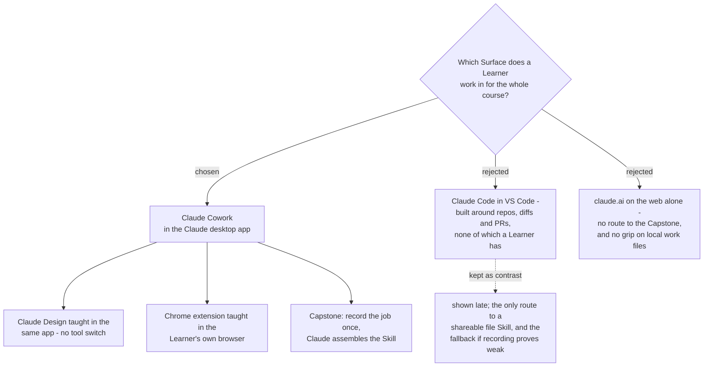

# Claude Cowork is the Spine of the course

The Learner is a project engineer consulting for factories, not a software
engineer, and the cohort is fixed: individual **Max** plans, **Mac** machines,
Chrome. Anthropic pitches Cowork at exactly the work these people do - reports,
spreadsheets, contract review, synthesis - while the VS Code extension is built
around repositories, inline diffs and pull requests, which a Learner does not
have and would see on screen for the entire course. Cowork is therefore the
Spine; Claude Code is shown late, for contrast.

## What made the choice decidable

Three facts settled it, and none were assumed:

- **The no-code Capstone route exists for exactly this cohort.** Anthropic:
  *"Recording a skill is available on Pro, Max, and Team plans, in Cowork in
  Claude for Mac. It isn't available in chat, on Windows, or on Free and
  Enterprise plans."* Max, Mac and not-Enterprise all hold, so the Learner can
  produce a working Skill without ever writing a file.
- **Claude Design is not gated behind Claude Code.** It has its own claude.ai
  help page and a Team/Enterprise admin guide, so teaching it costs no tool
  switch away from the Spine. An earlier constraint recorded on the
  `surface-choice` ticket claimed the opposite; it was wrong and is corrected
  here.
- **Sharing a Skill is optional.** The owner's words: *"ให้ก็ได้ ไม่ให้ก็ได้"*.
  A portable file Skill is Claude Code's one real advantage over recording, and
  with sharing optional it is a bonus rather than a requirement - so it does not
  drag the whole cohort into a terminal-shaped tool.

One argument was weakened rather than won: the VS Code extension **bundles its
own CLI for the chat panel**, so Claude Code there is a graphical panel and not
a terminal. "Too hard because terminal" is not the reason it lost. It lost on
*what the interface is about* - repos and diffs versus documents and reports.

## Consequences

- **Cowork ships its own browser** (desktop app only), which overlaps the Chrome
  extension the course must also teach. The course has to say plainly when to
  use which, or Learners will conflate them. Carried to
  `chrome-extension-usecases`.
- **Two risks are unproven and must be tried by hand before anyone teaches
  this.** First, the quality of a recorded Skill: if Claude assembles something
  a Learner cannot use, the Capstone falls back to writing `SKILL.md` in Claude
  Code and the final sessions get much heavier. Second, how well Cowork actually
  grips a Learner's local work folder: Anthropic's own copy says it runs locally
  in an isolated VM with access to local files and MCP, while the product page
  leads with connectors (Microsoft 365, Google Drive). The boundary was not
  resolved from published pages and must be measured. Both belong to
  `capstone-spec` and `lab-design-pattern`.
- **Individual Max means consumer terms.** There is no admin lever to set the
  training toggle for the cohort, so every Learner must set their own before the
  first Lab that carries real client work. Carried to `confidentiality-rule`.
