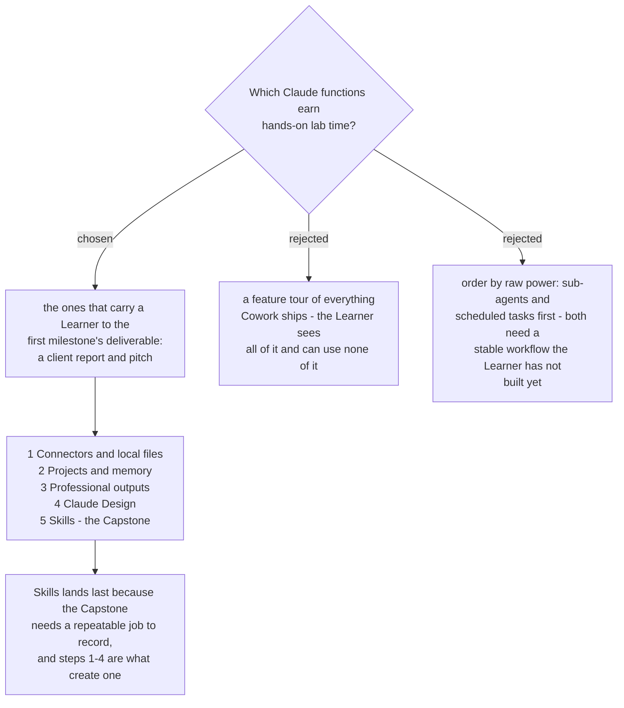

# Function coverage is ordered by the first milestone, not by the product's feature list

Coverage is decided by what reaches the first milestone - `report-pitch`, a
client-facing report and pitch for a consulting, management or business-analysis
engagement - rather than by what Cowork happens to ship. Five functions earn a
Lab, in the order a Learner meets them while producing one real report. Four are
demonstrated only. Three do not exist on the Spine at all.

## The three tiers

**Hands-on Lab** - Connectors and local files, Projects and memory, professional
outputs (Excel with working formulas, PowerPoint, formatted documents), Claude
Design, and Skills.

**Demonstrated only** - sub-agent coordination, scheduled tasks, plugins, and the
Chrome extension. The Chrome extension stays required course content; it is
simply not in the first increment.

**Not on the Spine, so not a decision** - hooks, plan mode, and the Claude Code
CLI. These are Claude Code concepts. The ticket's charted question listed hooks
and plan mode as candidates and omitted scheduled tasks entirely, because it was
written while a Claude Code Spine was still assumed. The list was re-scoped
against Cowork's documented capabilities before the tiering was decided.

## Why Skills comes last

The Capstone records a repeatable job. A Learner arriving on day one has no
repeatable job in Claude yet - they have one only after steps 1 to 4 have carried
a real report end to end. Teaching Skills earlier would mean recording a workflow
the Learner has not yet performed.

## Why scheduled tasks lost its Lab

It is plausibly the highest-value function in the whole product for a consultant
who files recurring progress reports and watches tender portals, and it runs in
the cloud without the Learner's machine being awake. It is demo-only anyway,
because it automates a workflow that must already be stable, and nothing is
stable during the course that created it. It is a candidate for a later
milestone, not a rejection.

## Three documented facts that landed with this decision

- **Cowork reads and writes local files directly** - *"Claude reads and writes
  local files without requiring manual uploads or downloads."* This settles half
  the open risk recorded in `claude-course-0001`, which noted a contradiction
  between Anthropic's copy and the product page. A hands-on check is still worth
  doing; the contradiction is not.
- **The Chrome extension pairs with Cowork by design** - *"Pair Claude in Chrome
  with Cowork to automate your tasks on any website."* `claude-course-0001`
  framed this as an overlap the course must adjudicate. It is a pairing, not a
  clash, and `chrome-extension-usecases` should treat it that way.
- **Cowork does not read the Claude Code CLI's `~/.claude` directory** - *"To use
  a skill or plugin that exists only in `~/.claude`, add it in Customize."* The
  Capstone fallback in `claude-course-0001` - writing `SKILL.md` in Claude Code
  if recording proves too weak - therefore carries an extra step that must be
  taught, not assumed.
