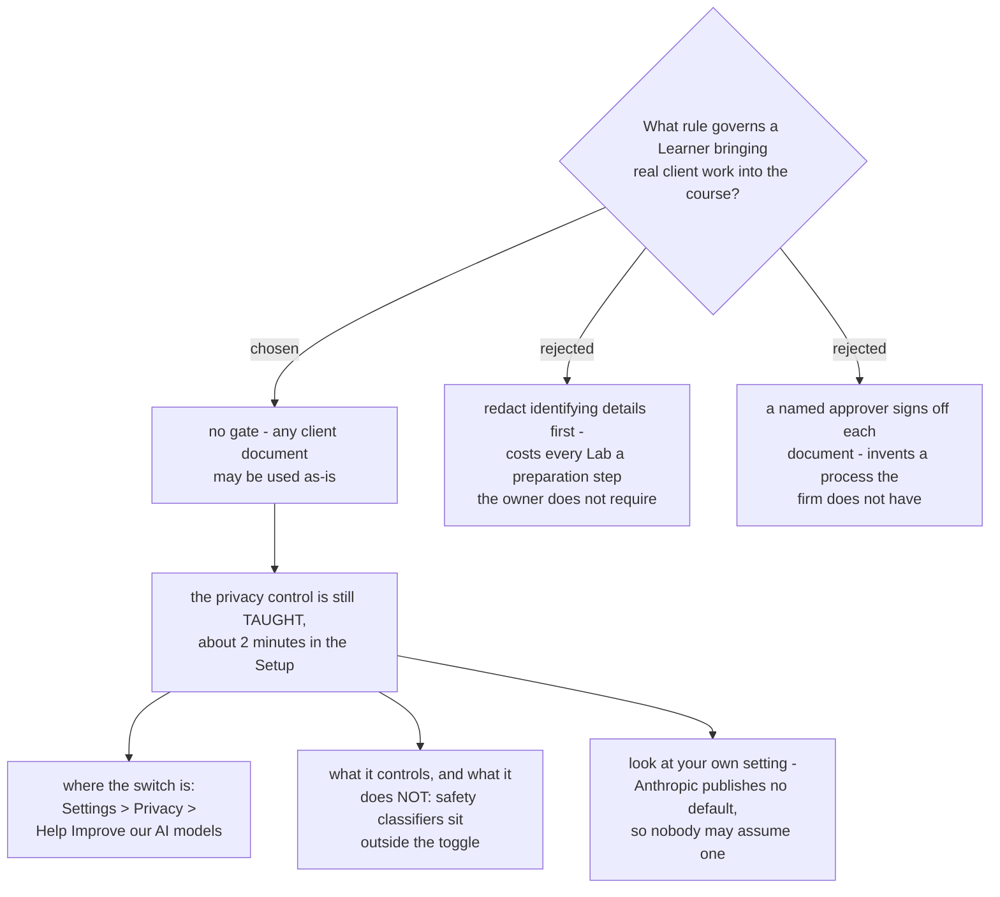

# No confidentiality gate on Lab material; the privacy control is taught, not enforced

The owner's position is that Lab material carries no confidentiality constraint:
*"ความลับของเอกสารที่เอามาใช้ ตอนนี้ใช้ได้หมด ไม่ต้องกลัวหลุด"*. There is
therefore no redaction step, no approver and no document that has to be kept out
of the room. The decision recorded on the map - Learners bring their own real
client work - stands unqualified.

## Taught, not enforced

The privacy control is still course content, for a reason that has nothing to do
with permission: a Learner is a consultant, and a factory client will eventually
ask where their data went. A consultant who cannot answer that has a professional
problem, not a compliance one. About two minutes in the Setup covers it.

## Three facts the teaching must carry

- **Where the switch is** - Settings, then Privacy, then *Help Improve our AI
  models*, at `claude.ai/settings/data-privacy-controls`.
- **What the switch does not cover.** Anthropic: *"If our safety classifiers flag
  your conversations, they may still be used to improve our internal trust and
  safety models, detect harmful content, enforce our policies, or advance our
  safety research."* A Learner told "switch it off and you are done" would be
  taught something false.
- **Look, do not assume.** Anthropic's own privacy page does **not** state
  whether the setting is on or off by default for a new Pro or Max account. An
  earlier note on the `account-plan` ticket said the default was reported to be
  on; that came from secondary coverage, and the primary page does not say it.
  The instruction that survives is to open the setting and read it, which is
  checkable per Learner and does not depend on a default anyone has published.

## Consequence

The course has **no designed fallback** for a Learner whose only real example
cannot be shown to the room. It does not need one under this decision, but if the
position ever changes, that gap is where the change lands first.

## Naming corrected 2026-08-28

This ADR originally wrote "the setup Lab". `claude-course-0009` established
that the setup sitting is **not** a Lab - a Lab operates on the Learner's own
client work and the Setup does not - so the slot is named **Setup**. The
decision recorded above is unchanged; only the name of the slot it sits in.
