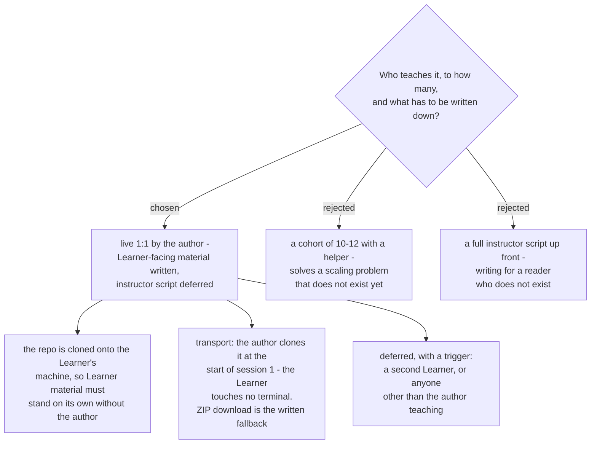

# Taught live 1:1 by the author; Learner material is written, the instructor script is not

The course is taught live, one to one, by its author. That removes the constraint
that would otherwise have shaped everything: because every Lab runs on the
Learner's own files, instructor attention does not scale like a lecture, and a
cohort would have forced either a helper or a change in Lab format. With one
Learner, neither is needed.

## Why Learner material is still written

The repo is cloned onto the Learner's machine. A cloned repo with nothing in it
is useless, so handouts, Lab steps and pass checks have to stand on their own
there - the author being in the room does not excuse writing them. This is the
half of "how much gets written" that is settled.

## Why the instructor script is not

With one Learner and the author teaching, an instructor script is written for a
reader who does not exist. It is deferred rather than rejected, and the trigger
is named: **a second Learner, or anyone other than the author teaching.** Naming
the trigger is the point - a deferral without one is just an omission that nobody
notices until it hurts.

## Transport, and why it is not `git clone` by the Learner

`claude-course-0001` chose a Spine with no terminal. Having the Learner run
`git clone` would put a terminal in the first minute of the course, contradicting
the reason the Spine was chosen. The author clones it instead, at the start of
session 1. A ZIP download is documented in the material as the fallback for
anyone doing setup without the author present. This choice is scoped to one
Learner and is one of the things the trigger above reopens.

## Consequence worth exploiting

A cloned course repo sitting on the Learner's Mac **is** a folder Cowork can read
and write directly (`claude-course-0002`). Labs can therefore reference files in
the repo by path, with no upload step at all. `repo-layout` should design for
that rather than treat it as a coincidence.
