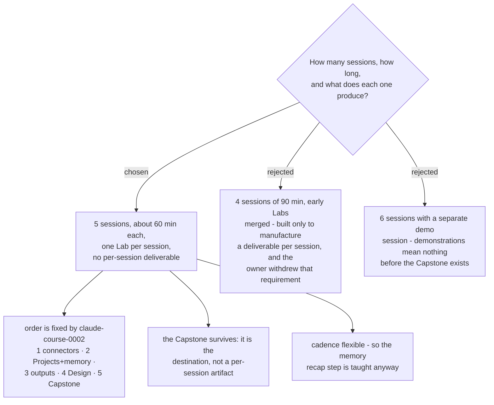

# Five short sessions, one Lab each, and no per-session deliverable

The course runs as five sessions of roughly sixty minutes, one Lab per session,
in the order already fixed by `claude-course-0002`. Session five teaches the
Capstone Skill and then closes with short demonstrations of sub-agents, scheduled
tasks, plugins and the Chrome extension.

## No deliverable per session

The charted Question asked what a Learner walks out of each session holding. The
answer is **nothing, by decision**: the owner's words were *"ไม่จำเป็นต้องมีของ
กลับบ้านก็ได้ แค่สอน"*. This is recorded so a later reader does not treat it as an
oversight and design one in.

Withdrawing that requirement is what settled the session count. A per-session
deliverable would have forced the early Labs to merge, because "my files now reach
Claude" is not something a Learner would show anyone. Without it, one Lab per
session is both simpler and closer to the short-consecutive-sessions shape decided
when the map was charted.

## The Capstone is not a per-session deliverable

"Just teach" removes the artifact from each session. It does not remove the goal.
The destination states that a Learner can write their own working Skill, so the
Capstone stays in session five. Removing it would be a change to the map's
destination, not to this ticket.

## Cadence: assumed, not confirmed

The gap between sessions was asked three times and never answered. It is recorded
as **flexible, fitted to the Learner's own job queue**, and this is an assumption
rather than a stated preference.

The assumption is safe because of how it is handled: the course **teaches the
memory recap step regardless**. A Learner opens each session by asking Claude to
summarise the previous one from the Project memory. This costs about two minutes,
it is useful even when sessions are on consecutive days, and it removes the only
way a wrong cadence guess could damage the course. If the real cadence is
consecutive days, this ADR needs one line changed and nothing else.
