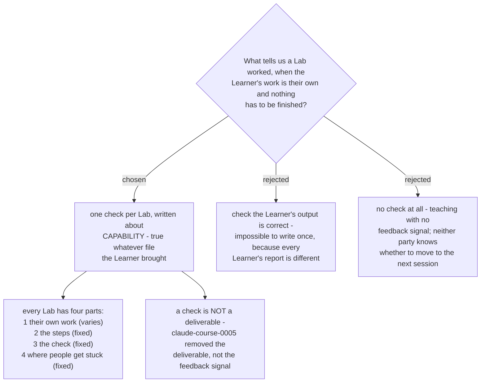

# Every Lab has the same four parts, and its check tests capability, not content

Every Lab is written to the same four-part shape. One part varies - the Learner's
own file and their own client. Three are fixed and live in the repo: the steps,
one check, and the list of places people get stuck.

## The check is about capability

A check that says "the report is correct" cannot be written once, because every
Learner brings different work. A check written about what the Learner can now
**do** can. It holds whatever file they brought, and it takes under a minute.

| Lab | The check |
|---|---|
| 1 Connectors and local files | Ask Claude a question whose answer is only in your own file. It answers correctly. |
| 2 Projects and memory | Close the Project and reopen it. Ask what you did last time. It answers. |
| 3 Professional outputs | Change a source cell. The summary number that goes to the client must move. **Strengthened 2026-08-28 by claude-course-0007**; the original check was "open the Excel file, change one number, the formulas recalculate", which proves the spreadsheet works but not that the client-facing figure was computed rather than typed. |
| 4 Claude Design | Open the result on a phone. It is still readable. |
| 5 The Capstone Skill | Ask for the job in ordinary words, without naming the Skill. It runs. |

The Lab 5 check is what proves the Capstone passed. A `SKILL.md` that exists but
never triggers is not a working Skill, and only this check catches that.

## A check is not a deliverable

`claude-course-0005` removed the requirement that a Learner walks out of each
session holding something. It did not remove the need for a feedback signal.
Without a check, neither the author nor the Learner knows whether to move to the
next session, and a Lab that silently failed is discovered several sessions later.
This distinction is recorded because it is the easiest place to misread the two
decisions together.

## What the cohort of one changed

The charted Question asked how a Lab stays repeatable "when every learner supplies
different input", which assumed a cohort. `claude-course-0004` settled on one
Learner, so the many-Learners-in-one-room problem does not exist. The pattern is
still written to be input-independent, because that costs nothing here and is
exactly what the second Learner would need. Part four - where people get stuck -
is the part that can only be filled in by teaching the first Learner, so it starts
empty and is written from what actually happens.

## Amended 2026-08-28

The Lab 3 check in the table above was strengthened by `claude-course-0007`. The
rest of this ADR stands: the four-part pattern, the capability-not-content rule,
and the four other checks are unchanged. The amendment scopes the original Lab 3
check rather than replacing the decision it belonged to.
