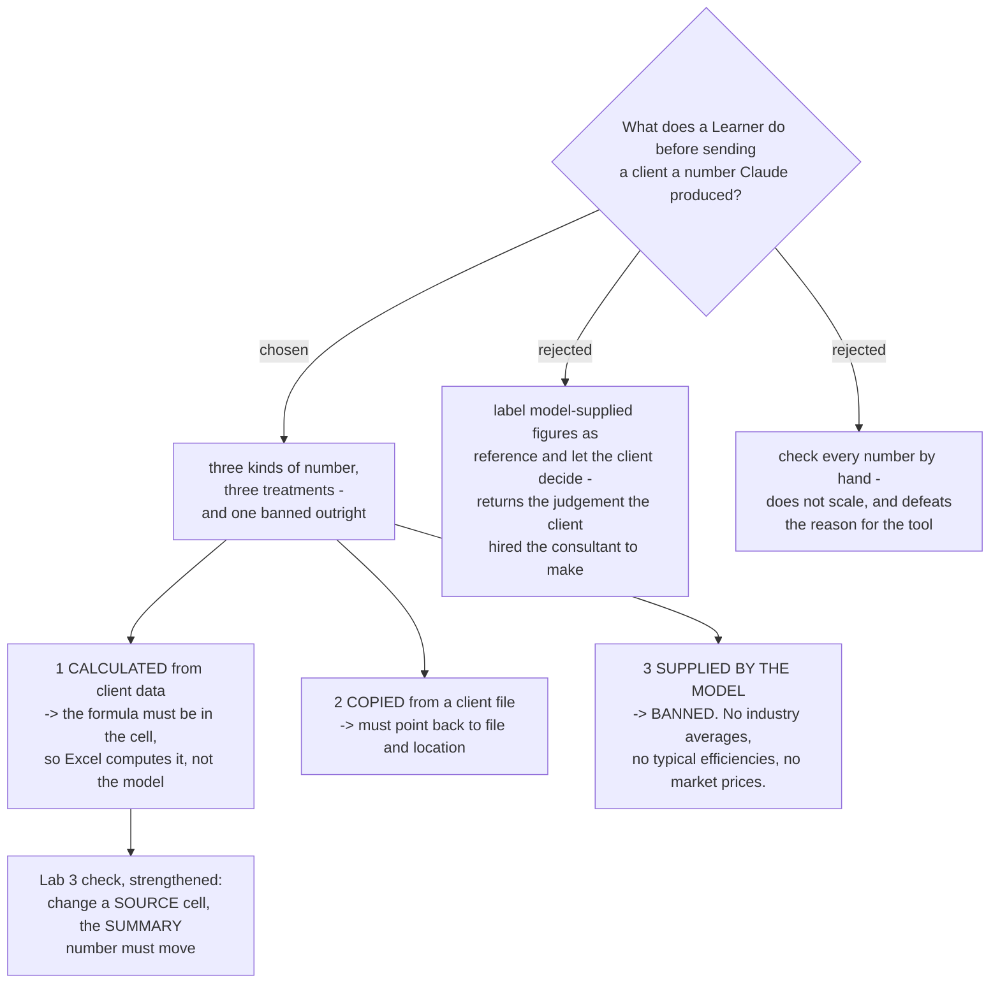

# A number must point to a source, and a figure the model supplied is banned

Not every number carries the same risk, so the course does not treat them the
same. Three kinds, three treatments. The rule a Learner carries out of the course
is one sentence: **if you cannot point at where a number came from, it is not
ready to send to a client.**

## The three kinds

**Calculated from the client's own data** - a BOQ total, unit price times
quantity, an average running hour. Low risk, but only on one condition: the
**formula must be in the cell**. Then Excel does the arithmetic and the model
does not. The Learner checks the formula once instead of checking every figure.

**Copied from a client file** - a supplier quotation, a reading from a site
report. Medium risk: the wrong row, the wrong sheet, or the wrong unit. Every such
number must point back to its file and its location.

**Supplied by the model** - a typical boiler efficiency, an industry average, a
market price. **Banned.** This is the highest risk of the three precisely because
it is the most convincing: no formula, no source, and it reads as authority.

The ban was the owner's decision and it is stronger than the alternative that was
offered. Labelling such a figure as "reference only" and letting the client decide
hands back the judgement the client hired the consultant to make.

## Amendment to claude-course-0006

The Lab 3 check recorded in `claude-course-0006` was *"open the Excel file, change
one number, the formulas recalculate"*. That proves the spreadsheet works. It does
not prove the number a client will read was computed rather than typed. As of
2026-08-28 the check is strengthened to:

> **Change a source cell. The summary number that goes to the client must move.**

One action, two properties: the spreadsheet recalculates, **and** the client-facing
figure is computed rather than pasted in as a constant. If it does not move, the
model typed a value, which is the entire risk of this ADR caught in one gesture.
The original check is not wrong, only weaker; it is scoped by this amendment
rather than deleted.

## Which Lab carries it

Lab 3, where numbers are produced, and it is enforced by that Lab's check. The Lab
1 check already primes the habit - it asks a question whose answer exists **only**
in the Learner's own file, which is the same idea one step earlier.

## Consequence for the teaching

The ban removes a demonstration that would otherwise be tempting. Asking Claude
for a typical benchmark makes a striking demo and is exactly the behaviour this
course must not build. Where a benchmark is genuinely needed, the Learner finds a
source themselves and it becomes a kind-two number.
