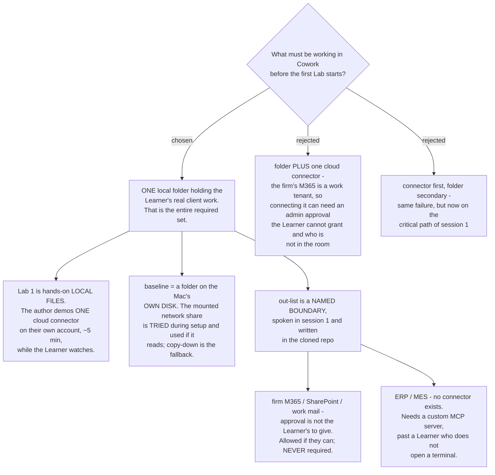

# Lab 1 requires one local folder, and no connector is a prerequisite

The required set before Lab 1 is **one local folder**. Nothing else. No connector
is a prerequisite for anything in this course.

This follows from a fixed fact about the cohort rather than a preference: the
Learners are on **individual Max plans**, and their firm's Microsoft 365 is a work
tenant. Connecting a work tenant from a personal account can require an
administrator's consent, and that administrator is not in the room. Requiring a
connector would put a step outside the author's control on the critical path of
minute five of session 1.

The check written for Lab 1 in `claude-course-0006` already passes on a local file
alone - *"ask Claude a question whose answer is only in your own file"* - so
nothing was weakened to reach this.

## What Lab 1 now does

`claude-course-0002` names Lab 1 *"Connectors and local files"*. With no connector
required, the two halves split:

- **Hands-on** - the Learner works on local files in their own folder. This is the
  Lab, and it is what the Lab 1 check measures.
- **Demonstrated** - the author connects one cloud drive on their own account,
  about five minutes, while the Learner watches. The Learner leaves having seen
  what a connector is and able to add one later unaided.

Having the Learner practise on a **personal** Google Drive was rejected: CONTEXT.md
defines a Lab as an exercise on the Learner's **own real client work**, and a
personal drive is not that. It would be a demonstration wearing a Lab's name.

## Which folder, when the real work is on a network share

A project engineer's live client work is usually not on the laptop's own disk - it
sits on a mounted project share. Whether Cowork's isolated VM reads a mounted share
is **not measured**, so the course does not depend on it:

- **Required baseline** - a folder on the Mac's own disk. The course can never be
  blocked.
- **Tried first, during setup** - point Cowork at the mounted share. If it reads,
  that becomes the working folder and nothing is copied.
- **Fallback** - copy one project folder down.

Lab 1 runs unchanged either way, which is the point of ordering it like this. The
copy-down-always alternative was rejected because the copy goes stale and it
teaches a habit that does not survive the end of the course.

## The out-list has two reasons, not one

Both are stated out loud in session 1 and written as a short section in the cloned
course repo, because the boundary is what a Learner needs months later, at their
desk, when the question actually arrives.

| Out | Reason | Status |
|---|---|---|
| Firm Microsoft 365, SharePoint, work mail | Approval is not the Learner's to give on an individual Max account | **Not forbidden.** A Learner who can connect it alone may. Nothing in the course depends on it. |
| ERP, MES, factory systems | No connector exists. Reaching them needs a custom MCP server | **Hard boundary.** Not taught, not demonstrated, not a fallback. |

Silent omission was rejected. The most predictable question a Learner asks after
the course is *"can it read our ERP?"* - and a course that never said invites them
to assume either too much or too little.

## Consequence for env-setup-lab

`env-setup-lab` inherits three things from this decision: the required set is one
folder on local disk, the setup lab carries the network-share attempt as a
try-then-fall-back step, and the boundary section is authored material the Learner
keeps. The day-zero setup therefore has no external dependency and no step that
can fail for reasons outside the room.
