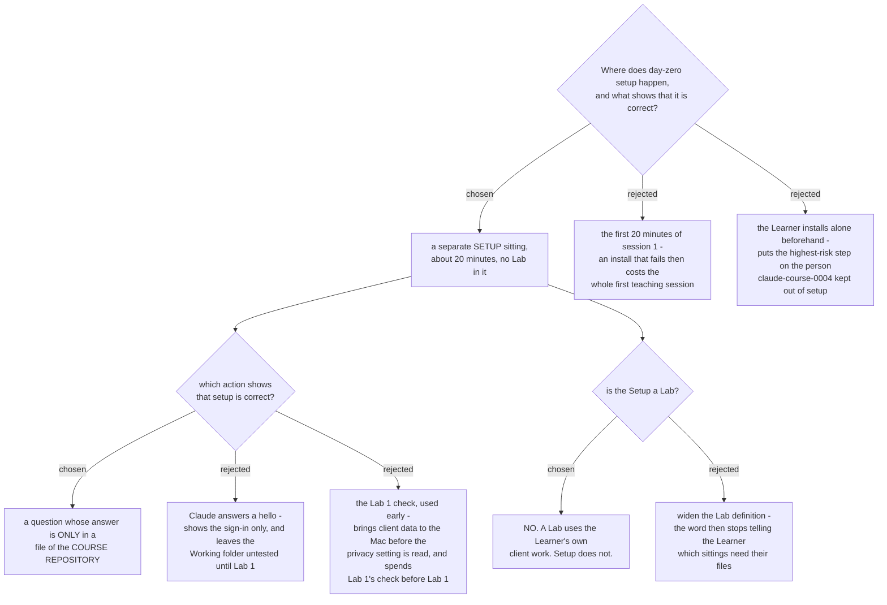

# Setup is a separate sitting, it is not a Lab, and its check uses the course repository

Day-zero setup happens in its own sitting of about 20 minutes. It is **not** a
Lab. Its check is a question whose answer is only in a file of the cloned course
repository.

## Why setup leaves session 1

Session 1 is 60 minutes (`claude-course-0005`) and already holds the privacy
segment and the whole of Lab 1. Install and sign-in on an untouched Mac is
15 to 20 minutes and it is the highest-variance step in the course: download,
Apple ID, sign-in, plan check, and Cowork appearing at all.

A separate sitting bounds that risk. An install that fails costs a short sitting.
It does not cost the one session where the Learner forms their impression of the
tool.

**Consequence for `claude-course-0005`.** That ADR says five sessions. The count
is unchanged - it counts **teaching sessions that carry a Lab**. As the Learner
experiences it there are now six sittings: one Setup and five sessions. Say it
that way in the material, so nobody reads the sixth as an oversight.

## Why the check uses the course repository

Two constraints meet here. `claude-course-0001` requires each Learner to read
their own training setting before any Lab carries real client work, and
`claude-course-0003` puts that two-minute privacy segment in the setup slot. So
the setup check must run **before** client material is on the machine.

The cloned course repository is already a Working folder that holds no client
data (`claude-course-0004`). One question about a file in it proves the whole
chain in a single action:

- the application is installed,
- the sign-in is correct,
- Cowork is present on this plan,
- and a Working folder genuinely reads.

"Claude answers a hello" was rejected because it proves only the sign-in and
leaves the Working folder - the thing every Lab depends on - untested until
Lab 1, which is precisely where you do not want to find the fault.

## The order inside the Setup, and why it is forced

| | Step | Why it is here |
|---|---|---|
| 1 | Install the Claude desktop app on the Mac | The Spine is Cowork in that app (`claude-course-0001`) |
| 2 | Sign in to the Learner's own Max account | Cowork requires the plan |
| 3 | The author copies the course repository onto the Mac | `claude-course-0004`; ZIP download is the written fallback |
| 4 | Point Cowork at the course repository as a Working folder | It holds no client data |
| 5 | **The check** - ask a question whose answer is only in a file there | Proves the chain with no client data present |
| 6 | The privacy segment, about two minutes | Must precede any client material (`claude-course-0001`, `claude-course-0003`) |
| 7 | Point Cowork at the Learner's own Working folder - try the mounted network share first, copy-down is the fallback | `claude-course-0008`; it brings client data, so it follows step 6 |

Steps 5, 6 and 7 are in that order for one reason: the check must not need client
data, and the client folder must not arrive before the privacy setting is read.

**Prerequisite, outside the Setup.** The Learner holds an individual Max
subscription before the sitting begins. Buying it is not a step of the Setup.

## Why the Setup is not a Lab

`CONTEXT.md` defines a **Lab** as one exercise a Learner performs on their own
real client work. The Setup uses the course repository, which is not client work.
Calling it a Lab would cost the word its one useful property: a Learner can no
longer tell from the name which sittings need their own files.

So the course has **one Setup and five Labs**. `Setup` joins the glossary as its
own term. This ADR corrects the words "the setup Lab" in `claude-course-0003`;
the decision recorded there is unchanged, only its name for the slot.

## What the Setup inherits from claude-course-0006

The Setup is not a Lab, but three of the four fixed parts still apply and are
written in the repository: the steps, the one check, and the
where-people-get-stuck list. The fourth part - the Learner's own varying work -
is exactly what the Setup does not have, which is the same fact that makes it not
a Lab. Its stuck-list starts empty on purpose, and it is likely to be the first
one that fills.
