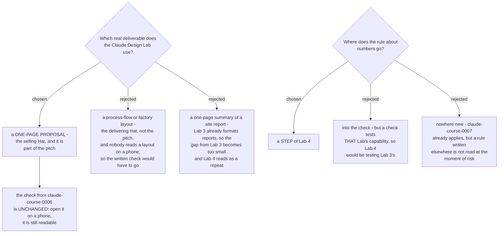

# The Claude Design Lab is built around a one-page proposal, and the number rule is a step

Lab 4 is built around a **one-page proposal**: one designed page the Learner
leaves with a client. The Lab 4 check is unchanged. The rule that keeps the page
honest is a **step** of the Lab, not a second check.

## Why a one-page proposal

`claude-course-0002` fixed the rule for earning Lab time: a function earns it by
carrying the Learner to `report-pitch`, a client-facing report **and a pitch**.
Lab 3 already produces the report - Excel with working formulas, PowerPoint,
formatted documents. The one-page proposal is the pitch, and it is the half of
the milestone nothing else in the course reaches.

A process-flow or factory layout diagram was the strongest rejected option, and
for a real reason: it is what Lab 3's PowerPoint is worst at, so Claude Design
looks most impressive there. It lost on two counts. It wears the **delivering**
Hat rather than the selling one, so it serves the report half a second time. And
it breaks the check.

## The written check is what decided it

`claude-course-0006` already fixed the Lab 4 check: *"Open the result on a phone.
It is still readable."*

That check only measures something for an artifact a client genuinely opens on a
phone. A one-page proposal is forwarded and read on a phone constantly. A factory
layout never is - a check that nobody would perform in real life proves nothing,
and choosing the diagram would have meant rewriting a check that was deliberately
written once.

The check therefore did work here rather than sitting decorative: it selected the
deliverable. That is the point of writing checks about **capability** early.

## Why the number rule is a step, not a second check

The concrete embarrassment for this artifact is narrow and predictable. The
one-page proposal shows 35 percent. The report behind it shows 28 percent. The
client holds both. That is the failure this Lab has to prevent.

`claude-course-0007` already bans a figure the model supplied and requires a
copied number to name its file and location. Applied to Lab 4, that is exactly
the rule needed. So it becomes a **step** of Lab 4:

> Every number on the page comes from the Lab 3 file. The Learner points at the
> file and the location.

It is not folded into the check, because `claude-course-0006` requires a check to
test **that Lab's** capability. Lab 4's capability is Claude Design. A check about
number tracing would make Lab 4 test Lab 3's capability instead, and Lab 3's own
check already does that better - change a source cell, the summary number moves.

Leaving it unwritten was rejected too. `claude-course-0007` does apply
course-wide, but a rule recorded in another document is not read at the moment the
risk occurs. The Lab has to name it where the Learner is standing.

## The four parts of Lab 4

Per `claude-course-0006`:

| Part | Lab 4 |
|---|---|
| Varies | The Learner's own proposal, for their own real engagement |
| Steps | Fixed, and they now carry the number-tracing step above |
| One check | Open the result on a phone. It is still readable. **Unchanged.** |
| Where people get stuck | Starts empty, filled from teaching the first Learner |

## Consequence

Lab 3 and Lab 4 are now a chain rather than two tool demonstrations: Lab 3
produces the numbers, Lab 4 puts them on a page a client keeps. `capstone-spec`
should note that this pair is the most obvious repeatable job in the course, and
therefore a strong candidate for what the Learner records as their Capstone Skill.
