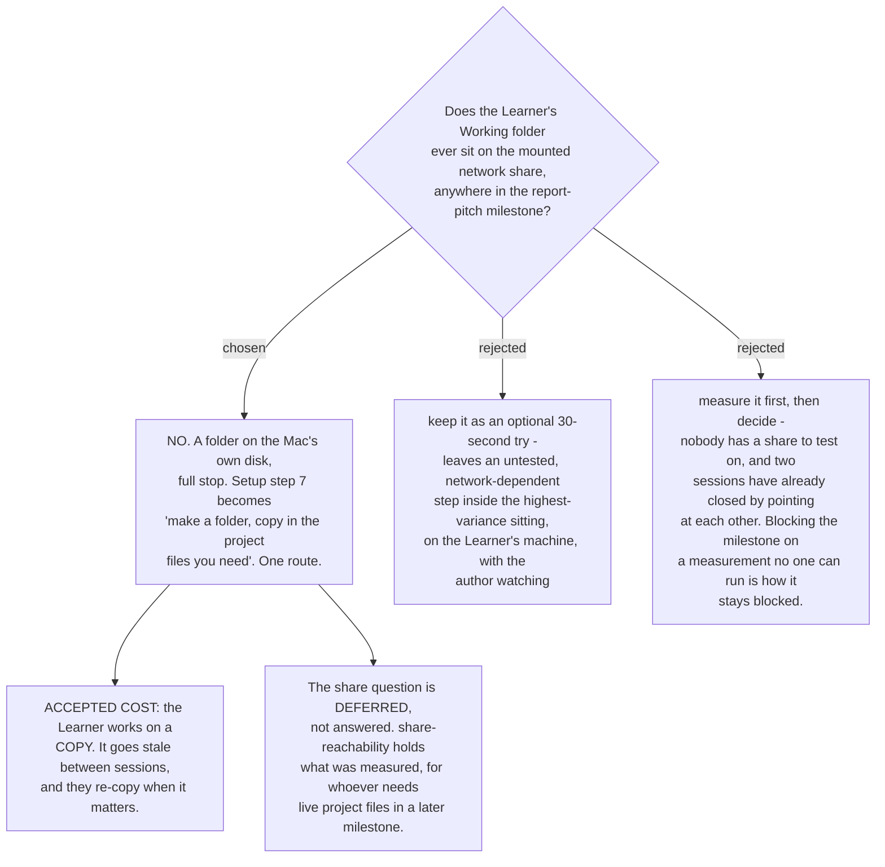

# The Working folder is local only for the first milestone, and the network share is not tried

Through the whole `report-pitch` milestone, a **Working folder is a folder on the
Mac's own disk**. The mounted network share is not required, not preferred, and
not attempted.

## What this changes

Two ADRs currently say otherwise, and both are amended rather than rewritten:

- `claude-course-0008` made the share **tried first** during setup and the working
  folder if it read, with copy-down as the fallback.
- `claude-course-0009` carried that into **step 7** of the Setup sitting: *"try the
  mounted network share first, copy-down is the fallback."*

Step 7 now reads: **point Cowork at a folder on the Learner's own disk, holding
the project files they copied into it.** Nothing else about the Setup moves - the
step order that `claude-course-0009` calls forced is forced for reasons that have
nothing to do with where the folder lives.

## Why the try-step goes rather than shrinks

The optional-attempt version is the tempting one: thirty seconds, and if it works
the Learner gets live files for free. It was rejected on the ground
`claude-course-0009` already established.

That ADR pulled the Setup out of session 1 because install-and-sign-in is the
**highest-variance step in the course**, and a failure there costs a short sitting
rather than the session where the Learner forms their impression of the tool. An
attempt to mount a work network share is that same class of step: it depends on
VPN, on the firm's permissions, on a server the author does not control, and on a
Cowork behaviour **nobody has ever observed**. Putting it back into the sitting
that exists to contain variance defeats the reason the sitting exists.

The failure mode is not a broken course - copy-down catches it. The failure mode
is the first ten minutes of a consultant's first encounter with Claude being spent
watching something not work.

## The cost this accepts, stated plainly

`claude-course-0008` rejected copy-down-always with a real objection: *the copy
goes stale and it teaches a habit that does not survive the end of the course.*
That objection is not withdrawn. It is **outranked**, for this milestone, by three
facts:

1. The share route was never proven to work, so the habit it would teach was
   hypothetical. Copy-down is the only route that has ever been known to run.
2. The course is five taught sessions. A copy that goes stale over weeks does not
   go stale inside one 60-minute Lab, and the Learner re-copies when they return.
3. Nothing the Labs check depends on the files being live. Every check in
   `claude-course-0006` is about capability - can Claude read your file, does the
   number move, is it readable on a phone - and a copy satisfies all of them.

What the Learner must be told, in the Setup and once in session 1: **you are
working on a copy.** Not as a caveat, as an instruction - re-copy before a session
where the numbers matter.

## What was measured before this was decided

The measurement `share-reachability` asked for was never run, and this decision
means it is not needed for `report-pitch`. What *was* established, on the author's
own Mac (macOS 26.5.2, Claude 1.37937.3, from `~/Library/Logs/Claude/`), is the
mechanism a later measurement would be testing:

- Cowork is a full Linux VM under Apple's Virtualization framework.
- Host folders reach it over **virtiofs**, appearing in the guest at
  `/mnt/.virtiofs-root/shared/<the host's absolute path>` and then bind-mounted
  per session onto `/sessions/<name>/mnt/work`.
- Every share observed sat under `shared/Users/<user>/…`, the host path reproduced
  verbatim - consistent with a share rooted at `/` rather than at the home folder.
- No `/Volumes/` path appears in any log, but no network share has ever been
  mounted on that machine, so this is **not evidence either way**.

The open question, for whoever picks it up: does virtiofs traverse into a
different filesystem mounted at `/Volumes`, and does Cowork's folder picker offer
one at all. It needs a Mac with a real share mounted, which is exactly what was
not available.

## Scope of this decision

`report-pitch` only. It is not a statement that Cowork cannot read a share, and it
does not close the question - it removes the course's dependency on the answer. A
later milestone that genuinely needs the Learner on **live** project files rather
than a copy reopens it, and `share-reachability` holds the mechanism notes above
so that session does not start from nothing.
