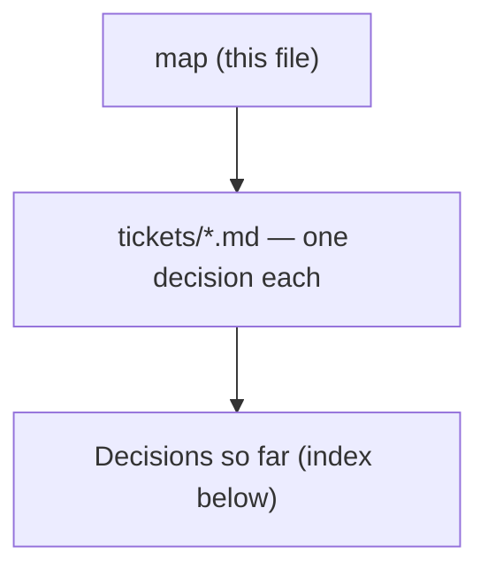

# Decision map - Claude workshop for factory consulting engineers

## Destination
A live-taught workshop, run as several short consecutive sessions, after which a project engineer who consults for factories uses Claude across selling, delivering and documenting the work, and can write their own working skill.

## Notes

<!-- decision-map:notes:start -->
- Backend is local markdown under docs/decision-map/ in c:/Repo2/ai traing user, which is not a git repo yet.
- Decided: learners bring their own real client work as the lab material.
- Decided: all course documents and labs are written in English only.
- Decided: the format is several short consecutive sessions, not one block course.
- Decided: learners have admin rights and can install anything on their machines.
- Decided: the pass evidence is a capstone SKILL.md that works on the learner's own job, with proof it triggers.
- Decided: labs must cover four artifact families - sales (proposal, RFQ reply, estimate), technical documents (spec, BOQ, drawing note), reports (site report, progress, minutes), and factory data analysis.
- Decided: Claude Design, the canvas artifact skill, is required course content and not optional.
- Decided: the Claude Chrome extension is required course content, and it must be taught through named use cases from the consultant's own browser work, not as a feature tour.
- Milestones were deliberately skipped at chart time; group the tickets later from work-map.
- Decided: Claude Cowork in the desktop app is the Spine (claude-course-0001). Claude Code is shown late, as contrast and as the fallback if record-a-skill proves too weak.
- Decided: the cohort is individual Max plans on Mac machines with Chrome - not Team, not Enterprise, not company-managed. This supersedes the Team/Enterprise recommendation in account-plan's gist.
- Decided: sharing a finished Skill with teammates is optional, not a course requirement.
- Decided: coverage is ordered by the first milestone, not by the product's feature list (claude-course-0002). Lab: connectors and local files, Projects and memory, professional outputs, Claude Design, then Skills. Demo only: sub-agents, scheduled tasks, plugins, Chrome extension.
- Documented: Cowork reads and writes local files directly, the Chrome extension pairs with Cowork by design, and Cowork does not read the Claude Code CLI's ~/.claude directory - a SKILL.md written there must be added in Customize.
- Decided: Lab material carries no confidentiality constraint - any client document is used as-is, with no redaction step and no approver (claude-course-0003). The privacy control is taught as consultant knowledge, about two minutes in the setup Lab, not enforced as a gate.
- Known gap: no fallback is designed for a Learner whose only real example cannot be shown to the room. It does not arise under claude-course-0003; if that position ever changes, this is where the change lands first.
- Corrected: Anthropic's own privacy article states no default for the consumer training toggle. The course tells Learners to open and read their own setting rather than assume one. This supersedes the reported-default-on claim in the comment on account-plan.
- Decided: taught live 1:1 by the author, cohort of one for now (claude-course-0004). Learner-facing material IS written, because the repo is cloned onto the Learner's machine; the instructor script is deferred, with a named trigger - a second Learner, or anyone other than the author teaching.
- Decided: the author clones the repo onto the Learner's machine at the start of session 1, so the Learner touches no terminal and the first minute does not contradict the no-terminal Spine. A ZIP download is the written fallback for setup without the author present.
- Consequence: the cloned course repo is simultaneously the material and the Learner's Cowork working folder, so Labs can reference its files by path with no upload step. Design for this in repo-layout.
- Decided: five sessions of about 60 minutes, one Lab per session, in the order fixed by claude-course-0002. Session 5 teaches the Capstone and closes with the demonstrations (claude-course-0005).
- Decided: there is NO deliverable per session. The owner withdrew that requirement, which is what settled the session count. Recorded so a later reader does not treat it as an oversight and design one in.
- ASSUMPTION, not confirmed: the gap between sessions is flexible and fitted to the Learner's job queue. It was asked three times and never answered. The course teaches the memory recap step in every case, so a wrong guess cannot damage it. Correcting this is one line of claude-course-0005.
- Decided: every Lab has four parts - the Learner's own work varies; the steps, one check and the where-people-get-stuck list are fixed and live in the repo (claude-course-0006).
- Decided: a Lab check is written about CAPABILITY, not content, so it is writable once and holds whatever file the Learner brought. A check is NOT a deliverable - claude-course-0005 removed the deliverable, not the feedback signal.
- The where-people-get-stuck part of every Lab starts EMPTY on purpose. It is filled in from what actually breaks while teaching the first Learner, which is also the cheapest form of the instructor material deferred by claude-course-0004.
- Decided: a number must point to a source (claude-course-0007). Calculated numbers carry their formula in the cell so Excel computes them, copied numbers name their file and location, and figures the model supplied - industry averages, typical efficiencies, market prices - are BANNED outright.
- Amended: the Lab 3 check from claude-course-0006 is strengthened to 'change a source cell, the summary number that goes to the client must move'. The original check proved the spreadsheet works, not that the client-facing figure was computed rather than typed. Recorded on claude-course-0006 and as a comment on the closed lab-design-pattern ticket.
- Cost accepted with the ban: asking Claude for a typical industry figure is the most striking demonstration available and is now forbidden, because it is exactly the habit the course must not build.
- Decided: the entire prerequisite for Lab 1 is ONE Working folder on the Learner's own disk (claude-course-0008). No Connector is required by anything in the course - the cohort is on individual Max, and connecting the firm's work tenant can need an admin approval the Learner cannot grant and who is not in the room.
- Decided: Lab 1 splits - hands-on is local files, and the author demonstrates ONE Connector on their own account for about five minutes while the Learner watches. Having the Learner practise on a personal Google Drive was rejected against CONTEXT.md's own Lab definition: a personal drive is not their real client work.
- Decided: a folder on the Mac's own disk is the required baseline, but the mounted network share where a project engineer's real work usually lives is TRIED during setup and becomes the Working folder if Cowork reads it; copy-down is the fallback and Lab 1 runs unchanged either way.
- NOT MEASURED: whether Cowork's isolated VM reads a mounted SMB share. No test was run for cowork-connectors. The decision is structured so the answer cannot block the course either way, and the measurement belongs to env-setup-lab.
- Decided: the out-list is a named boundary, spoken in session 1 and written in the cloned repo, with two different reasons - firm M365/SharePoint/work mail are never required though allowed if the Learner can connect them alone, and ERP/MES are a hard boundary because no connector exists.
- Glossary: Connector and Working folder split into two terms in CONTEXT.md. The Lab 1 name 'Connectors and local files' conflated them, and this decision turns on them being two routes that fail differently.
- Corrected: this repo IS under git (branch main). The chart-time note saying it is not a git repo yet is stale - the map, the ADRs and CONTEXT.md are all committed here.
- Decided: day-zero setup is its own sitting of about 20 minutes, and it is NOT a Lab (claude-course-0009). Install and sign-in is the highest-variance step in the course, so a failure costs a short sitting rather than the one session where the Learner forms their impression of the tool.
- Decided: the Setup check is a question whose answer is only in a file of the cloned course repository. One action proves the application is installed, the sign-in is correct, Cowork is present on this plan, and a Working folder genuinely reads - with no client data on the Mac.
- Decided: the Setup's step order is forced, not chosen. The check (step 5) must not need client data; the privacy segment (step 6) must precede the Learner's own Working folder (step 7), because that is what brings client material to the machine.
- Glossary: Setup is now its own term in CONTEXT.md, and claude-course-0003's wording 'the setup Lab' was corrected by a dated amendment on that ADR. A Lab operates on the Learner's own client work; the Setup does not, and widening the Lab definition would cost the word the one property that makes it useful.
- Clarified: claude-course-0005's count of five sessions is UNCHANGED - it counts teaching sessions that carry a Lab. As the Learner experiences it there are six sittings: one Setup and five sessions. The material must say it that way so nobody reads the sixth as an oversight.
- Prerequisite, outside the Setup: the Learner holds an individual Max subscription before the sitting begins. Buying it is not a step of the course.
- STILL NOT MEASURED: whether Cowork's isolated VM reads a mounted SMB share. Both cowork-connectors and env-setup-lab closed without testing it and each pointed at the other, so it is now the ticket share-reachability. It needs a real Mac in front of a real project share.
- Decided: Lab 4, Claude Design, is built around a ONE-PAGE PROPOSAL (claude-course-0010) - the selling Hat, and the pitch half of report-pitch that nothing else in the course reaches. A process-flow or factory layout diagram was the strongest rejected option: it is what Lab 3's PowerPoint is worst at, but it wears the delivering Hat and it breaks the written check.
- Notable: the Lab 4 check written in claude-course-0006 is what SELECTED the deliverable. A one-page proposal is forwarded and read on a phone; a factory layout never is, so for a layout the check would measure nothing. First clear evidence that the capability-first checks are load-bearing rather than paperwork.
- Decided: the number rule from claude-course-0007 becomes a STEP of Lab 4, not a second check - every number on the page comes from the Lab 3 file and the Learner points at file and location. A check tests that Lab's own capability, and Lab 4's capability is Claude Design, so the Lab 4 check is unchanged.
- Glossary: Deliverable is now a term in CONTEXT.md. The word carried two senses in this repo - the Learner's own client artifact, and the per-session course output that claude-course-0005 withdrew. Only the first sense is used.
- Consequence for capstone-spec: Lab 3 into Lab 4 is a chain, not two tool demonstrations. Lab 3 produces the numbers, Lab 4 puts them on a page the client keeps. That is the most obvious repeatable job the course creates, so it is the leading candidate for what the Learner records as their Capstone Skill.
- Decided: NO network share anywhere in report-pitch (claude-course-0011). Setup step 7 is a folder on the Mac's own disk with the project files copied into it - one route, no attempt. The optional 30-second try was rejected because it puts a VPN-and-permissions-dependent step back inside the sitting that exists to contain variance.
- Accepted cost: the Learner works on a COPY. claude-course-0008's objection that a copy goes stale is NOT withdrawn, it is outranked for this milestone - and the Learner is told 're-copy before a session where the numbers matter' as an instruction, not a caveat.
- Amended by dated amendments: claude-course-0008's try-first ordering collapses to its baseline, and claude-course-0009's step 7 no longer names the share. Nothing else in either ADR moves.
- Measured on the author's Mac (macOS 26.5.2, Claude 1.37937.3): Cowork is a full Linux VM under Apple's Virtualization framework and reaches host folders over VIRTIOFS at /mnt/.virtiofs-root/shared/<host absolute path>, bind-mounted per session onto /sessions/<name>/mnt/work. STILL NOT MEASURED - whether virtiofs traverses into a filesystem mounted at /Volumes, and whether Cowork's folder picker offers one. No share was available to mount; the mechanism notes live on the closed share-reachability ticket.
<!-- decision-map:notes:end -->

## Milestones

<!-- decision-map:milestones:start -->
- `report-pitch` A Learner produces a client-facing report and pitch for a consulting, management or business-analysis engagement [function-coverage, cowork-connectors, confidentiality-rule, session-shape, lab-design-pattern, design-deliverable, env-setup-lab, teaching-mode, number-trust, share-reachability]
<!-- decision-map:milestones:end -->

## Decisions so far

<!-- decision-map:decisions:start -->
#### report-pitch — A Learner produces a client-facing report and pitch for a consulting, management or business-analysis engagement

- [Confidentiality - what rule governs bringing real client work into class?](tickets/confidentiality-rule.md) — No confidentiality gate on Lab material - any client document is used as-is; the privacy control is taught as consultant knowledge, not enforced.
- [Cowork connectors - which must a Learner have working before Lab 1, and which firm systems stay out?](tickets/cowork-connectors.md) — One Working folder on local disk is the entire prerequisite: no Connector is required, the author demos one, and firm M365 stays optional while ERP is a hard boundary.
- [Claude Design lab - which real deliverable is it built around?](tickets/design-deliverable.md) — The Claude Design Lab is built around a one-page proposal - the pitch half of the milestone - and the number rule from claude-course-0007 becomes a step of Lab 4, not a second check.
- [Setup lab - how does a learner get from a bare laptop to a working install?](tickets/env-setup-lab.md) — Setup is its own ~20-minute sitting, not a Lab: seven ordered steps ending with the client folder, and the check is a question answerable only from a file in the cloned course repository.
- [Coverage - which Claude functions are taught hands-on versus shown as reference?](tickets/function-coverage.md) — Lab time is earned by serving the report-pitch milestone: connectors, Projects, outputs, Design, then Skills. Sub-agents, scheduled tasks and plugins are demo-only.
- [Lab pattern - how is a lab repeatable when every learner brings different input?](tickets/lab-design-pattern.md) — Every Lab has four parts: their own work varies; the steps, one check and the stuck-list are fixed. The check tests capability, not content, so it is writable once.
- [Numbers - what does a Learner do before acting on a figure Claude produced?](tickets/number-trust.md) — A number must point to a source: calculated ones carry their formula in the cell, copied ones name file and location, and model-supplied figures are banned outright.
- [Session shape - how many sessions, how long, how often, and what does each deliver?](tickets/session-shape.md) — Five sessions of about 60 minutes, one Lab each, no per-session deliverable by decision. Cadence is an assumption, made safe by teaching the memory recap step in every case.
- [Mounted network share - does Cowork read one, and what happens if it does not?](tickets/share-reachability.md) — Deferred, not measured: the Working folder is local disk only through report-pitch, Setup step 7 drops the share attempt, and the virtiofs mechanism is recorded for whoever measures it later.
- [Teaching mode - who teaches it, to how many, and must it survive another instructor?](tickets/teaching-mode.md) — Live 1:1 by the author. Learner-facing material is written because the repo is cloned to their machine; the instructor script is deferred until a second Learner or a second instructor.

#### (unassigned)

- [Account plan - which Claude subscription do learners need, and what does it imply?](tickets/account-plan.md) — Team or existing Enterprise - commercial terms do not train on your data; all paid tiers include Code, Design, Chrome.
- [Existing material - what does Anthropic already publish that this course should build on?](tickets/existing-material.md) — Reuse Claude 101, AI Fluency, Chrome/Design guides; adapt Skills and Code docs; author all consultant content ourselves.
- [Surface - which Claude surface is the spine of the course?](tickets/surface-choice.md) — Claude Cowork in the desktop app is the Spine; Claude Code is shown late as contrast and as the fallback if record-a-skill proves too weak.
<!-- decision-map:decisions:end -->

## Not yet specified

<!-- decision-map:fog:start -->
- What each of the five Labs actually teaches, step by step, inside its 60-minute budget.
- Whether the course ships ready-made skills or a plugin for learners to install, or only teaches them to write their own.
- How learners keep improving after the course ends - refresher, internal community, or nothing.
- How business impact is measured after the course - time saved per proposal, or something else.
- When the Setup sitting happens relative to session 1 - same day, or a separate day. Related to the cadence assumption already recorded on session-shape.
- Whether any milestone after report-pitch puts the Learner on LIVE project files rather than a copy - that, and only that, is what reopens the network-share question closed by claude-course-0011.
<!-- decision-map:fog:end -->

## Out of scope

<!-- decision-map:scope:start -->
- Building the consulting firm's production tooling or integrations - the course teaches, it does not deliver systems.
- Teaching engineering fundamentals, consulting practice or sales technique themselves - the course assumes them.
- Comparing Claude against other AI vendors.
- Training anyone outside the project-engineer-as-consultant role.
- Reaching the firm's ERP or MES from Claude - no connector exists and it would need a custom MCP server, which is past a Learner who does not open a terminal.
<!-- decision-map:scope:end -->
