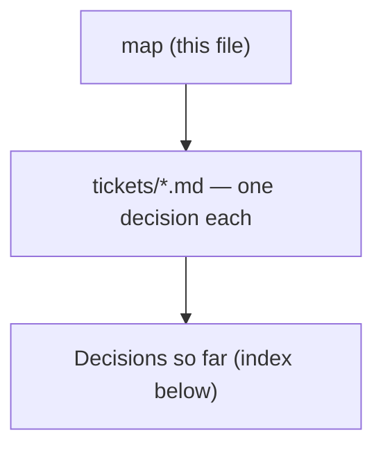

# Decision map - Claude workshop for factory consulting engineers

## Destination
A live-taught workshop, run as several short consecutive sessions, after which a project engineer who consults for factories uses Claude across selling, delivering and documenting the work, and can write their own working skill.

## Notes

<!-- decision-map:notes:start -->
- Backend is local markdown under docs/decision-map/ in c:/Repo2/ai traing user, which is not a git repo yet.
- Decided: learners bring their own real client work as the lab material.
- Decided: all course documents and labs are written in English only.
- Decided: the format is several short consecutive sessions, not one block course.
- Decided: learners have admin rights and can install anything on their machines.
- Decided: the pass evidence is a capstone SKILL.md that works on the learner's own job, with proof it triggers.
- Decided: labs must cover four artifact families - sales (proposal, RFQ reply, estimate), technical documents (spec, BOQ, drawing note), reports (site report, progress, minutes), and factory data analysis.
- Decided: Claude Design, the canvas artifact skill, is required course content and not optional.
- Decided: the Claude Chrome extension is required course content, and it must be taught through named use cases from the consultant's own browser work, not as a feature tour.
- Milestones were deliberately skipped at chart time; group the tickets later from work-map.
- Decided: Claude Cowork in the desktop app is the Spine (claude-course-0001). Claude Code is shown late, as contrast and as the fallback if record-a-skill proves too weak.
- Decided: the cohort is individual Max plans on Mac machines with Chrome - not Team, not Enterprise, not company-managed. This supersedes the Team/Enterprise recommendation in account-plan's gist.
- Decided: sharing a finished Skill with teammates is optional, not a course requirement.
- Decided: coverage is ordered by the first milestone, not by the product's feature list (claude-course-0002). Lab: connectors and local files, Projects and memory, professional outputs, Claude Design, then Skills. Demo only: sub-agents, scheduled tasks, plugins, Chrome extension.
- Documented: Cowork reads and writes local files directly, the Chrome extension pairs with Cowork by design, and Cowork does not read the Claude Code CLI's ~/.claude directory - a SKILL.md written there must be added in Customize.
- Decided: Lab material carries no confidentiality constraint - any client document is used as-is, with no redaction step and no approver (claude-course-0003). The privacy control is taught as consultant knowledge, about two minutes in the setup Lab, not enforced as a gate.
- Known gap: no fallback is designed for a Learner whose only real example cannot be shown to the room. It does not arise under claude-course-0003; if that position ever changes, this is where the change lands first.
- Corrected: Anthropic's own privacy article states no default for the consumer training toggle. The course tells Learners to open and read their own setting rather than assume one. This supersedes the reported-default-on claim in the comment on account-plan.
<!-- decision-map:notes:end -->

## Milestones

<!-- decision-map:milestones:start -->
- `report-pitch` A Learner produces a client-facing report and pitch for a consulting, management or business-analysis engagement [function-coverage, cowork-connectors, confidentiality-rule, session-shape, lab-design-pattern, design-deliverable, env-setup-lab]
<!-- decision-map:milestones:end -->

## Decisions so far

<!-- decision-map:decisions:start -->
#### report-pitch — A Learner produces a client-facing report and pitch for a consulting, management or business-analysis engagement

- [Confidentiality - what rule governs bringing real client work into class?](tickets/confidentiality-rule.md) — No confidentiality gate on Lab material - any client document is used as-is; the privacy control is taught as consultant knowledge, not enforced.
- [Coverage - which Claude functions are taught hands-on versus shown as reference?](tickets/function-coverage.md) — Lab time is earned by serving the report-pitch milestone: connectors, Projects, outputs, Design, then Skills. Sub-agents, scheduled tasks and plugins are demo-only.

#### (unassigned)

- [Account plan - which Claude subscription do learners need, and what does it imply?](tickets/account-plan.md) — Team or existing Enterprise - commercial terms do not train on your data; all paid tiers include Code, Design, Chrome.
- [Existing material - what does Anthropic already publish that this course should build on?](tickets/existing-material.md) — Reuse Claude 101, AI Fluency, Chrome/Design guides; adapt Skills and Code docs; author all consultant content ourselves.
- [Surface - which Claude surface is the spine of the course?](tickets/surface-choice.md) — Claude Cowork in the desktop app is the Spine; Claude Code is shown late as contrast and as the fallback if record-a-skill proves too weak.
<!-- decision-map:decisions:end -->

## Not yet specified

<!-- decision-map:fog:start -->
- What each of the four hat labs actually teaches, step by step.
- How a factory data-analysis lab keeps Claude from inventing a number the engineer will act on.
- Whether the course ships ready-made skills or a plugin for learners to install, or only teaches them to write their own.
- How learners keep improving after the course ends - refresher, internal community, or nothing.
- How business impact is measured after the course - time saved per proposal, or something else.
<!-- decision-map:fog:end -->

## Out of scope

<!-- decision-map:scope:start -->
- Building the consulting firm's production tooling or integrations - the course teaches, it does not deliver systems.
- Teaching engineering fundamentals, consulting practice or sales technique themselves - the course assumes them.
- Comparing Claude against other AI vendors.
- Training anyone outside the project-engineer-as-consultant role.
<!-- decision-map:scope:end -->
