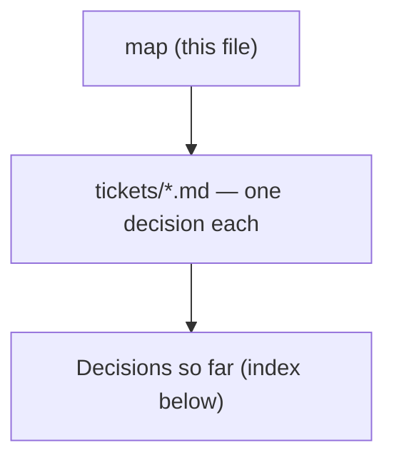

# Decision map - Claude workshop for factory consulting engineers

## Destination
A live-taught workshop, run as several short consecutive sessions, after which a project engineer who consults for factories uses Claude across selling, delivering and documenting the work, and can write their own working skill.

## Notes

<!-- decision-map:notes:start -->
- Backend is local markdown under docs/decision-map/ in c:/Repo2/ai traing user, which is not a git repo yet.
- Decided: learners bring their own real client work as the lab material.
- Decided: all course documents and labs are written in English only.
- Decided: the format is several short consecutive sessions, not one block course.
- Decided: learners have admin rights and can install anything on their machines.
- Decided: the pass evidence is a capstone SKILL.md that works on the learner's own job, with proof it triggers.
- Decided: labs must cover four artifact families - sales (proposal, RFQ reply, estimate), technical documents (spec, BOQ, drawing note), reports (site report, progress, minutes), and factory data analysis.
- Decided: Claude Design, the canvas artifact skill, is required course content and not optional.
- Decided: the Claude Chrome extension is required course content, and it must be taught through named use cases from the consultant's own browser work, not as a feature tour.
- Milestones were deliberately skipped at chart time; group the tickets later from work-map.
<!-- decision-map:notes:end -->

## Milestones

<!-- decision-map:milestones:start -->
- (none)
<!-- decision-map:milestones:end -->

## Decisions so far

<!-- decision-map:decisions:start -->
- [Account plan - which Claude subscription do learners need, and what does it imply?](tickets/account-plan.md) — Team or existing Enterprise - commercial terms do not train on your data; all paid tiers include Code, Design, Chrome.
<!-- decision-map:decisions:end -->

## Not yet specified

<!-- decision-map:fog:start -->
- What each of the four hat labs actually teaches, step by step.
- How a factory data-analysis lab keeps Claude from inventing a number the engineer will act on.
- Whether the course ships ready-made skills or a plugin for learners to install, or only teaches them to write their own.
- How learners keep improving after the course ends - refresher, internal community, or nothing.
- Whether MCP connectors to the firm's own systems (ERP, file share, mail) are inside the course.
- How business impact is measured after the course - time saved per proposal, or something else.
<!-- decision-map:fog:end -->

## Out of scope

<!-- decision-map:scope:start -->
- Building the consulting firm's production tooling or integrations - the course teaches, it does not deliver systems.
- Teaching engineering fundamentals, consulting practice or sales technique themselves - the course assumes them.
- Comparing Claude against other AI vendors.
- Training anyone outside the project-engineer-as-consultant role.
<!-- decision-map:scope:end -->
