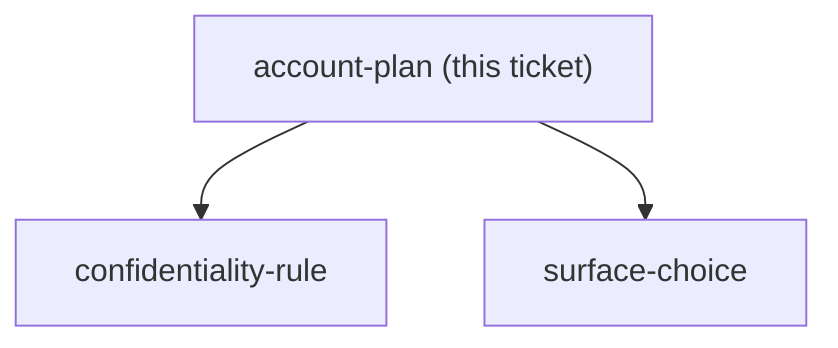
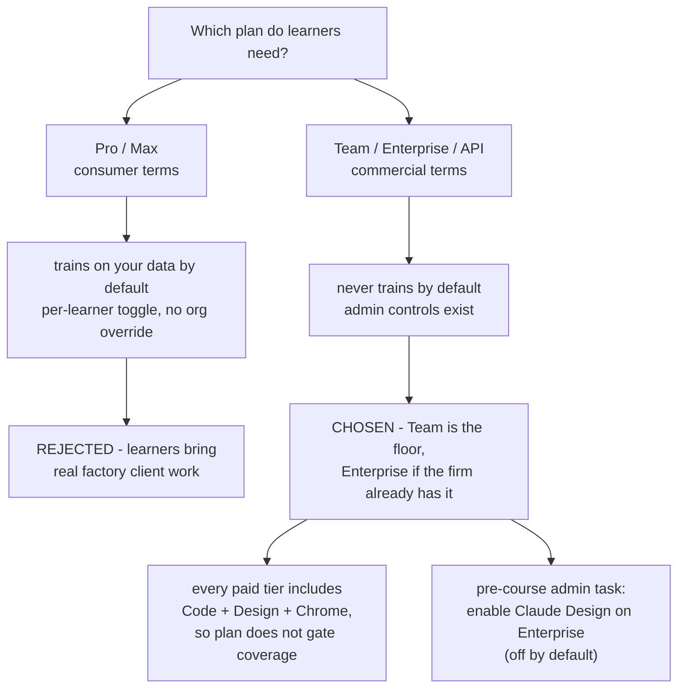

## Question

Which Claude plan or account setup (Pro, Max, Team, Enterprise, or API) does a learner need for this course, and for each option what are the cost per learner, the admin controls, and the data retention and training policy that apply when real client work is pasted in? Verify against Anthropic's own current published pages, not memory.

<!-- decision-map:graph:start -->

<!-- decision-map:graph:end -->

<!-- decision-map:resolution:start -->
## Resolution

Team or existing Enterprise - commercial terms do not train on your data; all paid tiers include Code, Design, Chrome.

Resolved by an AFK research subagent on 2026-08-28. Every claim below was fetched from Anthropic's own live pages, not from model memory. Items the agent could not confirm are listed under NOT VERIFIED and must be checked before any budget or policy statement is made to learners.

## Comparison

| Plan | Cost per learner | Claude Code | Claude Design | Chrome extension | Trains on your data by default | Retention | Admin controls |
|---|---|---|---|---|---|---|---|
| Pro | $17/mo annual, $20/mo monthly | Yes | Yes (research preview) | Yes (paid-plan gated) | **Yes, if the learner's personal toggle is on** | Opted-in 5 years; opted-out 30 days | **None at org level** - each learner manages their own toggle at claude.ai/settings/data-privacy-controls |
| Max | $100/mo (5x), $200/mo (20x) | Yes | Yes (research preview) | Yes | Same as Pro | Same as Pro | Same as Pro - no org layer |
| Team | Standard $20/mo annual, $25/mo monthly; Premium $100/$125; 2-150 seats | Yes, every seat | Yes | Yes | **No** - commercial terms | 30 days standard | SSO, JIT provisioning, central billing, member and connector management. SCIM / audit logs / custom retention are DISPUTED - see NOT VERIFIED |
| Enterprise | Self-serve ~$20/seat + metered API-rate usage; sales-assisted custom | Yes (older contracts may need a Chat + Claude Code or Premium seat type) | Yes, but **off by default** - an org admin must enable it | Yes | No | 30 days standard; custom retention configurable by Owner (min 30 days); Zero Data Retention available per-org via the account team | Full stack: SSO/SAML, SCIM, RBAC, audit logs via Compliance API, custom retention, HIPAA BAA, spend controls, usage analytics |
| API / Console commercial org | Usage-based per token, not a per-learner seat | Yes, and ZDR-eligible on this path | NOT VERIFIED | NOT VERIFIED | No | Not retained by default for most features; 30 days for Covered Models; ZDR available | Workspace privacy controls, per-workspace retention overrides, ZDR/HIPAA enablement, Compliance API |

## Sources

- https://claude.com/pricing
- https://claude.com/team
- https://claude.com/enterprise
- https://code.claude.com/docs/en/data-usage
- https://platform.claude.com/docs/en/manage-claude/api-and-data-retention
- https://privacy.claude.com/en/articles/10440198-configure-custom-data-retention-controls-for-enterprise-plans
- https://support.claude.com/en/articles/9797531-what-is-the-enterprise-plan
- https://support.claude.com/en/articles/11845131-use-claude-code-with-your-team-or-enterprise-plan
- https://www.anthropic.com/news/updates-to-our-consumer-terms
- https://www.anthropic.com/news/claude-design-anthropic-labs

Page currency: the code.claude.com and platform.claude.com pages are live versioned docs and read as current at fetch time. The Chrome-extension GA announcement is dated 2026-08-26, two days before this research ran. The claude.com marketing pages were fetched the same day, but WebFetch summarises through a smaller model, which is where the Team-versus-Enterprise contradiction below originated - treat the seat prices as reliable and the Team admin-feature claim as suspect.

## What this means for the course

- **Team or an existing Enterprise contract is the right default, not Pro or Max.** Commercial terms (Team, Enterprise, API) do not train on submitted data by default; Pro and Max sit under consumer terms with a per-learner toggle and no org override. Because learners bring real factory client work as lab material, this is the single most decisive variable in the whole question.
- **Plan choice does not gate curriculum coverage.** Claude Code, Claude Design and the Chrome extension are available on every paid tier - Pro, Max, Team and Enterprise. Plan choice decides data posture and admin control, nothing about what can be taught.
- **Team is the practical floor for a company-sponsored cohort**: 2-150 seats, Claude Code on every seat, Design and Chrome included, $20-25 per seat per month. That is cheap enough per learner to beat ad hoc personal Pro subscriptions, and it removes the per-learner privacy-toggle risk outright.
- **If the sponsoring firm already holds Enterprise, default there** - but add "enable Claude Design in Organization settings" to the pre-course admin checklist, because it is off by default and the session that teaches it will fail without it.
- **Do not run this course on personal Pro or Max accounts with real client data** unless every learner is individually walked through the training toggle before the first lab. There is no central lever to do it for them.
- For the capstone: skill authoring behaves identically across plans, so it does not affect the decision. One flag worth carrying - Agent Skills are listed as **not** ZDR-eligible even for orgs otherwise under Zero Data Retention, which matters if any learner's employer is HIPAA-adjacent.

## NOT VERIFIED

- Whether the Team admin console actually includes SCIM, audit logs and custom data-retention controls. claude.com/team claims yes; the dedicated Enterprise-versus-Team support article and the privacy.claude.com retention article both say these are Enterprise-only. Check the live Team admin console before telling learners what a Team upgrade buys.
- Whether the training toggle is pre-checked ON for new Pro/Max signups. Strongly indicated by secondary legal coverage of the Aug 2025 consumer-terms update, but no explicit "default: on" sentence was obtained from Anthropic's own page. Verify in a fresh account before stating it as fact.
- Exact Enterprise self-serve metered rates - "API rates" is all that is published.
- Whether Claude Design and the Chrome extension are reachable at all from a Console/API-only commercial org with no claude.ai seats.
- Whether Team has any admin toggle to restrict Claude Design or the Chrome extension per member. Enterprise has a confirmed one for Design; no Team equivalent was found.

<!-- decision-map:resolution:end -->

## Comment

## Correction from the session that worked surface-choice (2026-08-28)

The recorded gist recommends "Team or existing Enterprise". That was a
recommendation offered before the cohort was known. The owner has since stated
the actual situation, and it is different:

**Learners are on individual Max plans, on Mac machines, using Chrome.**
Not Team, not Enterprise, not company-managed.

The research above is not withdrawn - its plan comparison and its sources stand,
and its warning about consumer terms is now the operative half rather than the
footnote. What changes is which row applies:

- Max sits under **consumer terms**. The training toggle is per learner, there is
  **no admin lever** to set it for the cohort, and the reported default is on.
  Retention is 5 years when opted in, 30 days when opted out.
- Because learners bring real factory client work as lab material, every learner
  must be walked through claude.ai/settings/data-privacy-controls before the
  first lab. This is now a pre-course gate, not advice. It belongs to
  `confidentiality-rule`.
- The NOT VERIFIED item about the Team admin console is now moot for this cohort.
- The NOT VERIFIED item about whether the training toggle defaults to on is now
  **load-bearing** and must be checked in a real account before the course runs.

One capability flips with this, in the cohort's favour: recording a skill is
available on Pro, Max and Team, in Cowork in Claude for Mac, and is unavailable
on Windows and on Enterprise. Max plus Mac plus not-Enterprise means the no-code
skill-authoring path IS open to these learners. Resolved on `surface-choice`.

