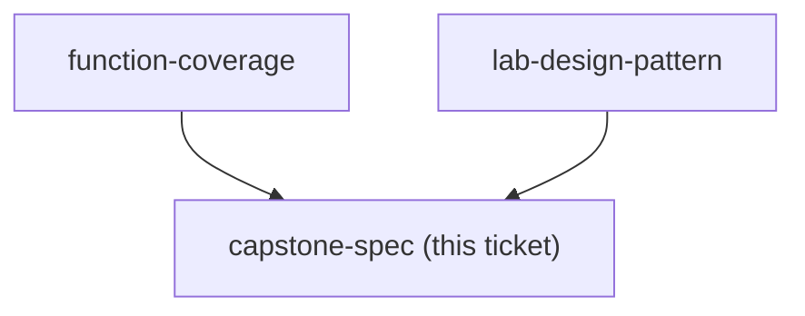

## Question

What exactly must the capstone skill do, and what is the check that proves it passes - that it triggers on the right request, that it produces the learner's real deliverable, and that someone else could run it?

<!-- decision-map:graph:start -->

<!-- decision-map:graph:end -->
