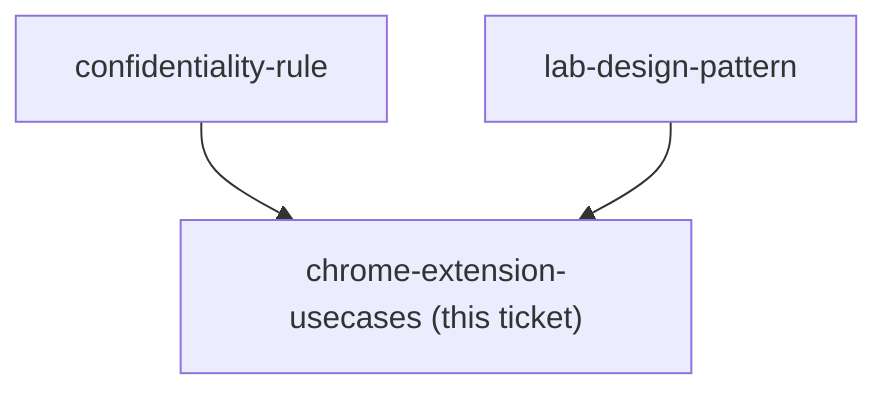

## Question

Which tasks in the consultant's browser day does the Claude Chrome extension actually take over - reading a customer's RFQ or tender portal, pulling supplier specs and prices, filling a submission form, checking a standard on a regulator site, working inside the firm's own web systems - and which of those must it be kept out of because the page holds client-confidential or contractual data? Every use case must name the page, the action, and the check that proves the result was right.

<!-- decision-map:graph:start -->

<!-- decision-map:graph:end -->
