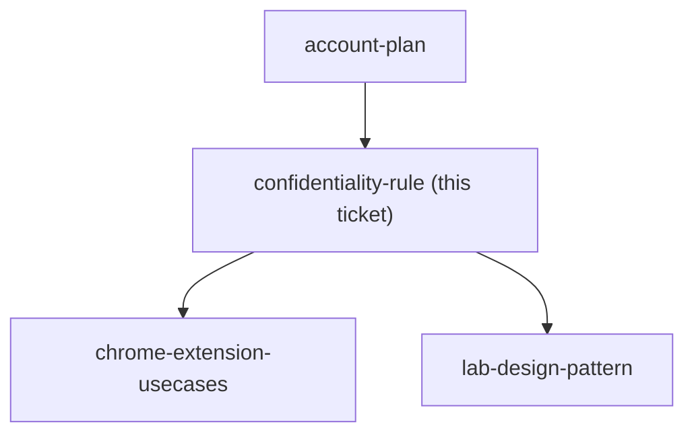

## Question

What rule governs a learner bringing real factory client work into Claude during the course - what may be pasted as-is, what must be redacted first, who decides, and what does the course do when a learner's only real example cannot be shown to the room?

<!-- decision-map:graph:start -->

<!-- decision-map:graph:end -->
