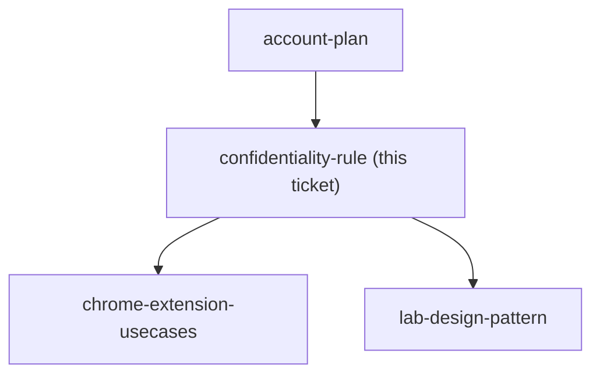
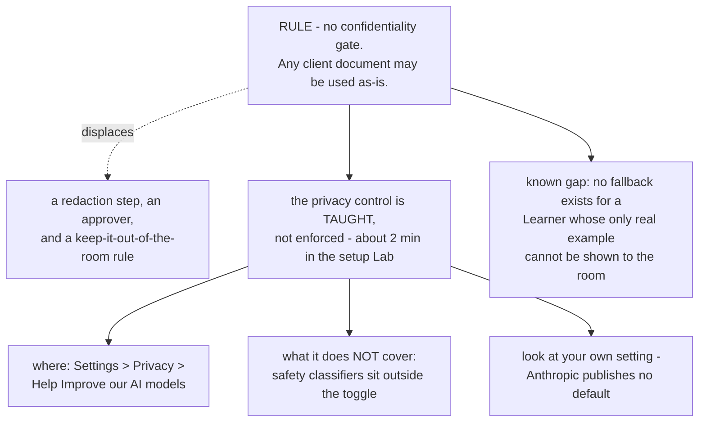

## Question

What rule governs a learner bringing real factory client work into Claude during the course - what may be pasted as-is, what must be redacted first, who decides, and what does the course do when a learner's only real example cannot be shown to the room?

<!-- decision-map:graph:start -->

<!-- decision-map:graph:end -->

<!-- decision-map:resolution:start -->
## Resolution

No confidentiality gate on Lab material - any client document is used as-is; the privacy control is taught as consultant knowledge, not enforced.

Detail: docs/adr/claude-course-0003-no-confidentiality-gate-on-lab-material.md

## The answer, part by part

The charted Question asked four things. Three of them dissolve under the owner's
position and one changes shape:

- **What may be pasted as-is** - everything. There is no category of client
  document the course keeps out.
- **What must be redacted first** - nothing. No preparation step is added to any
  Lab.
- **Who decides** - nobody. There is no approver, because there is nothing to
  approve.
- **What the course does when a Learner's only real example cannot be shown to
  the room** - it does not arise under this decision, and **no fallback is
  designed**. Recorded as a known gap rather than silently dropped: if the
  position ever changes, this is where the change lands first.

## What survived, and why it is not a gate

The privacy control is taught for a professional reason, not a compliance one. A
Learner is a consultant; a factory client will eventually ask where their data
went, and a consultant who cannot answer that has a problem regardless of what
their own firm permits. Roughly two minutes in the setup Lab, carrying three
facts:

1. Where the switch is - Settings, Privacy, *Help Improve our AI models*.
2. That it does not cover everything. Anthropic: *"If our safety classifiers flag
   your conversations, they may still be used to improve our internal trust and
   safety models, detect harmful content, enforce our policies, or advance our
   safety research."*
3. To read their own setting rather than assume a default.

## A correction to an earlier note

The comment this session's predecessor left on `account-plan` said the training
toggle's default was *reported* to be on. That came from secondary legal
coverage. Anthropic's own privacy article was fetched for this ticket and **does
not state a default at all**. The instruction the course carries is therefore
"open it and read it", which is checkable per Learner and depends on no
published default. The `account-plan` comment is left in place; this supersedes
its default claim.

## Confirming exchange

Asked whether the firm has a position on putting client data into an external AI
tool, and who decides what passes, the owner answered **"ความลับของเอกสารที่เอามาใช้
ตอนนี้ใช้ได้หมด ไม่ต้องกลัวหลุด"**. Asked the one remaining question - whether the
course should still teach where the privacy switch is, or drop it - the owner
chose **"สอน — ผู้เรียนตอบลูกค้าได้ และรู้ว่าตัวเองตั้งค่าอะไรอยู่ ราคาถูกมาก"**.

## What this hands to other tickets

- `env-setup-lab` - the two-minute privacy-control segment lands here, alongside
  the connector setup.
- `lab-design-pattern` - Labs carry no redaction or approval step, so the fixed
  half of a Lab is steps and checks only.
- `chrome-extension-usecases` - the "which pages must it be kept out of" half of
  that ticket's Question is now unconstrained by confidentiality; whatever
  remains there is about correctness, not permission.

<!-- decision-map:resolution:end -->
