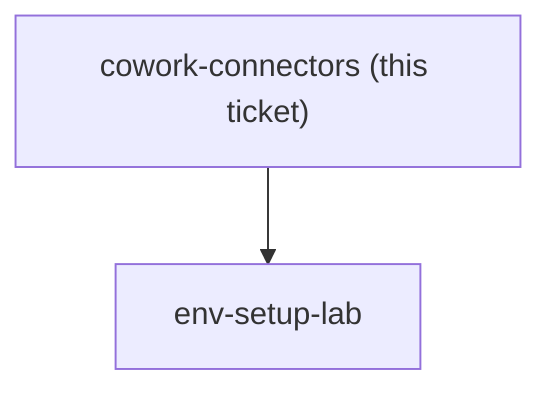

## Question

Which connectors must a Learner have working in Cowork before the first Lab - a local work folder, Microsoft 365, Google Drive - and which of the consulting firm's own systems (ERP, shared drive, mail) are deliberately left outside the course? Note the cohort is on individual Max, so any firm-managed system a Learner cannot connect on their own account is out by default, and note that how well Cowork grips a local folder is unverified: Anthropic's own copy says it runs locally in an isolated VM with access to local files, while the product page leads with connectors.

<!-- decision-map:graph:start -->

<!-- decision-map:graph:end -->
