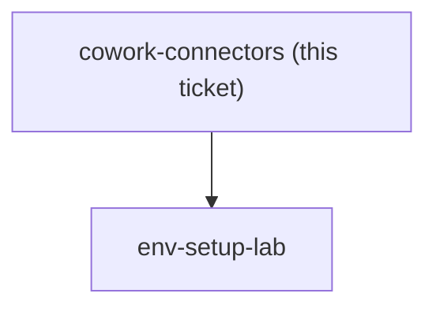
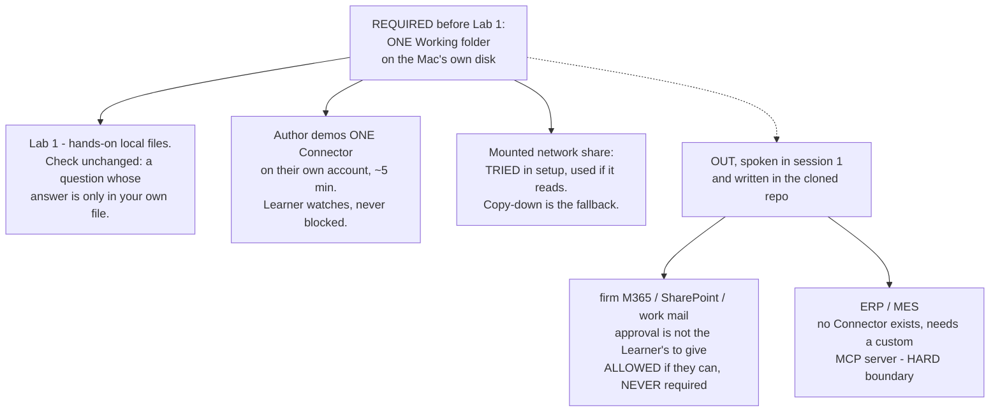

## Question

Which connectors must a Learner have working in Cowork before the first Lab - a local work folder, Microsoft 365, Google Drive - and which of the consulting firm's own systems (ERP, shared drive, mail) are deliberately left outside the course? Note the cohort is on individual Max, so any firm-managed system a Learner cannot connect on their own account is out by default, and note that how well Cowork grips a local folder is unverified: Anthropic's own copy says it runs locally in an isolated VM with access to local files, while the product page leads with connectors.

<!-- decision-map:graph:start -->

<!-- decision-map:graph:end -->

<!-- decision-map:resolution:start -->
## Resolution

One Working folder on local disk is the entire prerequisite: no Connector is required, the author demos one, and firm M365 stays optional while ERP is a hard boundary.

Detail: docs/adr/claude-course-0008-one-local-folder-no-connector-prerequisite.md

Recorded as `claude-course-0008`, which carries the rejected options and the
reasoning. Two glossary terms landed with it: **Connector** and **Working
folder**, split apart because the ticket's own title ("Connectors and local
files") treated them as one thing and the whole decision turns on them being two.

## What this changes about the first five minutes

The Learner opens Cowork and points it at a folder. No sign-in, no approval, no
external dependency. The failure mode this removes is concrete: on an individual
Max account, connecting the firm's work tenant can raise *"Need admin approval"*,
and that administrator is not in the room. The first thing the Learner would have
experienced of Claude is a ticket to IT.

## Confirming exchange

Four questions, four answers, all as recommended:

- **What must be working before Lab 1?** "Local folder only" - one folder holding
  their real client work is the entire required set.
- **What happens to the connector half of Lab 1?** "Author demos one, Learner does
  local." Having the Learner practise on a personal Google Drive was ruled out
  against CONTEXT.md's own definition of a Lab - a personal drive is not their real
  client work.
- **Which folder, when the real work is on a network share?** "Local disk
  required, share tried first." The share behaviour is unmeasured, so the course
  does not depend on it.
- **How are the out systems handled?** "Named boundary, spoken and written."

## What this hands to env-setup-lab

- The required set is one folder on local disk - no external dependency in day zero.
- The setup lab carries the network-share attempt as a try-then-fall-back step,
  which is also the measurement nobody has taken yet.
- The boundary section is authored Learner-facing material, consistent with
  `claude-course-0004` (Learner material is written; the instructor script is not).

## Not measured

Whether Cowork's isolated VM reads a mounted SMB share is **unverified** - no test
was run for this ticket. That is deliberate: the decision is structured so the
answer cannot block the course either way, and the measurement belongs to
`env-setup-lab`, where a real Mac is in front of a real share.

<!-- decision-map:resolution:end -->
