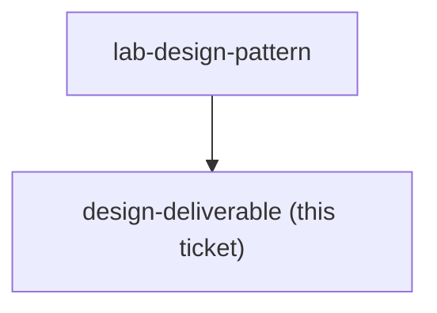

## Question

Which of the consultant's real deliverables is the Claude Design lab built around - a proposal one-pager, a site-report visual, a factory layout or process-flow diagram - and what separates an acceptable output from one that would embarrass the consultant in front of a client?

<!-- decision-map:graph:start -->

<!-- decision-map:graph:end -->
