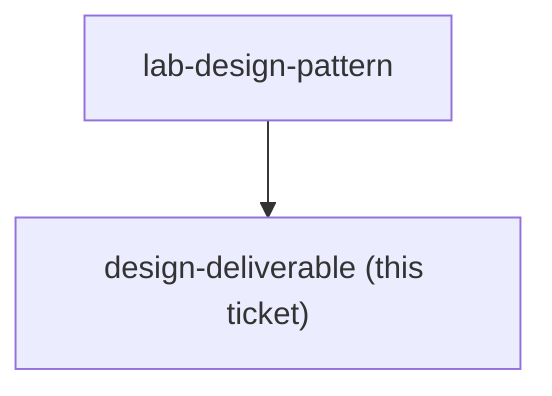
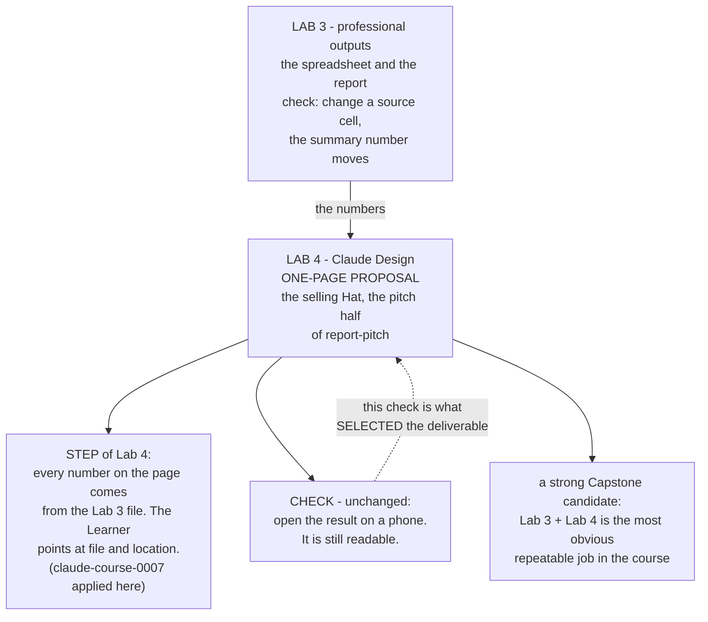

## Question

Which of the consultant's real deliverables is the Claude Design lab built around - a proposal one-pager, a site-report visual, a factory layout or process-flow diagram - and what separates an acceptable output from one that would embarrass the consultant in front of a client?

<!-- decision-map:graph:start -->

<!-- decision-map:graph:end -->

<!-- decision-map:resolution:start -->
## Resolution

The Claude Design Lab is built around a one-page proposal - the pitch half of the milestone - and the number rule from claude-course-0007 becomes a step of Lab 4, not a second check.

Detail: docs/adr/claude-course-0010-design-lab-is-a-one-page-proposal.md

Recorded as `claude-course-0010`, which carries both rejected sets. One glossary
term landed with it - **Deliverable** - because the word had drifted into two
senses in this repo: the Learner's own client artifact, and the per-session course
output that `claude-course-0005` withdrew. Only the first sense is used.

## The check did work rather than sit decorative

`claude-course-0006` wrote the Lab 4 check once, before the subject was chosen:
*"Open the result on a phone. It is still readable."* That check is what selected
the deliverable. A one-page proposal is forwarded and read on a phone constantly;
a factory layout never is, so for a layout the check would measure nothing and
would have had to be rewritten.

This is the clearest evidence so far that `claude-course-0006`'s capability-first
checks are load-bearing and not paperwork.

## Confirming exchange

Two questions, two answers, both as recommended:

- **Which deliverable?** "A one-page proposal." The strongest rejected option was
  a process-flow or factory layout diagram - genuinely the thing Lab 3's
  PowerPoint is worst at. It lost because it wears the delivering Hat rather than
  the selling one, so it serves the report half of the milestone a second time,
  and because it breaks the written check.
- **What stops the page disagreeing with the report?** "A step of Lab 4. The check
  does not change." Folding it into the check was rejected: a check tests that
  Lab's own capability, and Lab 4's capability is Claude Design, not number
  discipline. Writing nothing was rejected too - `claude-course-0007` does apply
  course-wide, but a rule recorded elsewhere is not read at the moment of risk.

## The failure this Lab exists to prevent

The one-page proposal shows 35 percent. The report behind it shows 28 percent. The
client holds both documents. That is the concrete embarrassment, and the
number-tracing step is aimed at exactly it.

## What this hands to other tickets

- **`capstone-spec`** - Lab 3 into Lab 4 is now a chain rather than two tool
  demonstrations, and it is the most obvious repeatable job the course creates.
  That makes it the leading candidate for what the Learner records as their
  Capstone Skill.
- **`repo-layout`** - Lab 4 needs its four parts authored: the varying part is the
  Learner's own proposal, the steps now carry the number-tracing step, the check is
  already written, and the stuck-list starts empty.

## Not decided here

What the one-page proposal contains, section by section. The Lab fixes the steps
and the check, not the content - the content is the Learner's own engagement, which
is the whole point of `claude-course-0006`. The step-by-step teaching of all five
Labs remains on the fog list.

<!-- decision-map:resolution:end -->
