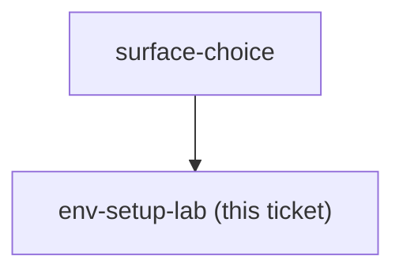

## Question

What is the day-zero setup lab that takes a learner from a bare company laptop to a working Claude install on the chosen surface, and what is the one check that proves it works before any teaching starts?

<!-- decision-map:graph:start -->

<!-- decision-map:graph:end -->
