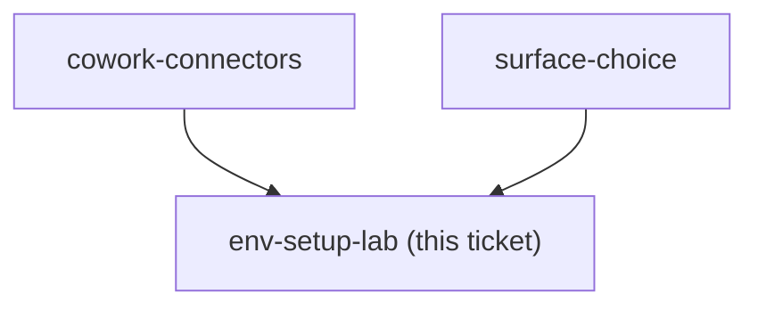
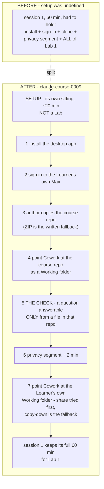

## Question

What is the day-zero setup lab that takes a learner from a bare company laptop to a working Claude install on the chosen surface, and what is the one check that proves it works before any teaching starts?

<!-- decision-map:graph:start -->

<!-- decision-map:graph:end -->

<!-- decision-map:resolution:start -->
## Resolution

Setup is its own ~20-minute sitting, not a Lab: seven ordered steps ending with the client folder, and the check is a question answerable only from a file in the cloned course repository.

Detail: docs/adr/claude-course-0009-setup-is-a-separate-sitting-not-a-lab.md

Recorded as `claude-course-0009`, which carries the rejected options. A glossary
term landed with it - **Setup** - and `claude-course-0003`'s wording "the setup
Lab" was corrected there by a dated amendment rather than deleted.

## Why steps 5, 6 and 7 are in that order

The order is forced, not chosen. `claude-course-0001` requires the Learner to read
their own training setting before any Lab carries real client work, and
`claude-course-0003` puts that segment in the setup slot. So the check must not
need client data, and the client folder must not arrive before the setting is
read. The cloned course repository is what makes that possible: it is already a
Working folder (`claude-course-0004`) and it holds nothing confidential.

One action at step 5 proves the whole chain - the application is installed, the
sign-in is correct, Cowork is present on this plan, and a Working folder genuinely
reads.

## Confirming exchange

Three questions, three answers, all as recommended:

- **Where does setup happen?** "A separate short setup sitting." Install and
  sign-in is the highest-variance step in the course; a failure now costs a short
  sitting instead of the one session where the Learner forms their impression of
  the tool.
- **What is the check?** "A question about the course repository." Rejected: a
  hello, which proves only the sign-in and leaves the Working folder untested
  until Lab 1.
- **Is the Setup a Lab?** "Not a Lab. Call it Setup." Widening the Lab definition
  was rejected because the word would stop telling the Learner which sittings need
  their own files.

## Two things this settles for other tickets

- **`claude-course-0005`'s five sessions is unchanged** - it counts teaching
  sessions carrying a Lab. The Learner now experiences six sittings: one Setup and
  five sessions. The material must say it that way, or a later reader treats the
  sixth as an oversight.
- **`repo-layout`** inherits three authored artifacts for the Setup: the steps,
  the one check, and an empty where-people-get-stuck list. The Setup is not a Lab,
  but three of `claude-course-0006`'s four fixed parts still apply; the missing
  fourth - the Learner's own varying work - is the same fact that makes it not a
  Lab.

## Still not measured

Whether Cowork's isolated VM reads a mounted SMB share. Step 7 carries the attempt
and the copy-down fallback, so the Setup is correct either way, but **no test has
been run** - not for `cowork-connectors` and not here. It needs a real Mac in front
of a real project share, which this session did not have.

The prerequisite outside the Setup: the Learner holds an individual Max
subscription before the sitting begins. Buying it is not a step.

<!-- decision-map:resolution:end -->
