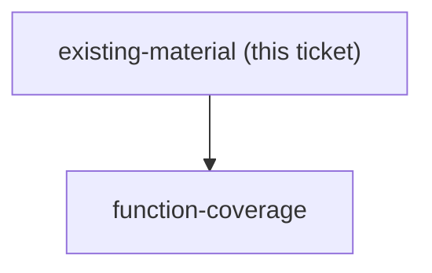
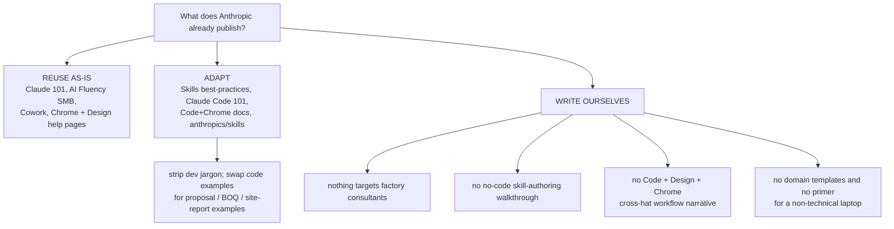

## Question

What official Anthropic learning material already exists - documentation, courses, cookbook, skill-authoring guides - that this workshop should reuse or point at rather than rewrite, and where are the gaps a factory-consulting audience still needs filled?

<!-- decision-map:graph:start -->

<!-- decision-map:graph:end -->

<!-- decision-map:resolution:start -->
## Resolution

Reuse Claude 101, AI Fluency, Chrome/Design guides; adapt Skills and Code docs; author all consultant content ourselves.

Resolved by an AFK research subagent on 2026-08-28. Inventory fetched from Anthropic's own live pages and repos, not from model memory. Each item is judged against THIS audience - a project engineer consulting for factories, not a software engineer.

## Reuse as-is

| Item | What it covers | URL |
|---|---|---|
| Claude 101 (Anthropic Academy) | Four modules: meet Claude, Projects/Artifacts/Skills, connecting tools, role-based use cases. No coding required, free, self-paced, certificate. Exactly the on-ramp a non-programmer needs. | https://anthropic.skilljar.com/claude-101 |
| AI Fluency: Framework and Foundations | The 4D framework - Delegation, Description, Discernment, Diligence - for working with AI safely and effectively. Foundational literacy, not tool-specific. | https://anthropic.skilljar.com/ |
| AI Fluency for Small Businesses | Nine lessons, about 54 minutes of video, built with PayPal and real small-business owners. Teaches the 4D framework plus AI limits via an interactive next-token simulator. The closest existing course to this audience's reality. | https://anthropic.skilljar.com/ai-fluency-for-small-businesses |
| Introduction to Claude Cowork | Hands-on collaboration on real projects and files in the desktop app - the no-CLI way to work with files, which matches how a project engineer touches Claude outside Code. | https://anthropic.skilljar.com/ |
| Get started with Claude in Chrome (Help Center) | Install, permissions and use-case walkthrough: 15 permissions explained plainly, workflow recording, scheduled tasks, multi-tab, 1Password. Accessible to non-developers as written. | https://support.claude.com/en/articles/12012173-get-started-with-claude-in-chrome |
| Get started with Claude Design (Help Center) | Explicitly states "you don't need to be a designer". Project creation, attaching context, natural-language iteration, exporting. Directly reusable for the Design segment. | https://support.claude.com/en/articles/14604416-get-started-with-claude-design |
| Claude Design admin guide (Team/Enterprise) | How an admin enables Design org-wide and sets up the shared design system and brand asset store. Needed once, by whoever runs the workshop's org account. | https://support.claude.com/en/articles/14604406-claude-design-admin-guide-for-team-and-enterprise-plans |
| Creating custom Skills (Help Center) - recording method only | The no-code path: record yourself doing a task and Claude builds the Skill from observation. The one official skill-authoring path a non-programmer can use unmodified. | https://support.claude.com/en/articles/12512198-creating-custom-skills |

## Adapt

| Item | What it covers | What is still missing for a factory consultant | URL |
|---|---|---|---|
| Skill authoring best practices | The canonical guide: SKILL.md structure, YAML frontmatter, progressive disclosure, degrees of freedom, evaluation-driven iteration. Excellent, but written for people who already think in tokens, scripts and validators. | Strip the jargon and replace the code-heavy examples with a proposal-template or site-report Skill built entirely from markdown instructions - no executable code, because this audience writes Skills without programming. | https://platform.claude.com/docs/en/agents-and-tools/agent-skills/best-practices |
| Extend Claude with skills (Claude Code docs) | Claude Code mechanics: .claude/skills/, slash invocation, CLAUDE.md versus skill, sharing via plugins. Assumes CLI and file-path comfort. | A guided first-Skill walkthrough that uses Claude Code itself to write the Skill conversationally, skipping folder and YAML mechanics as something typed by hand. | https://code.claude.com/docs/en/skills |
| Introduction to Agent Skills (Academy) | Six chapters: build, configure and share Skills in Claude Code, priority hierarchies, org-wide deployment, tool restrictions. | Developer-flavoured; assumes Claude Code fluency already. Must be sequenced after a "what is a Skill and why would I want one" primer, and paired with a non-code worked example. | https://anthropic.skilljar.com/introduction-to-agent-skills |
| Claude Code 101 (Academy) | Onboarding for people new to software engineering or engineers exploring AI coding agents. Assumes some notion of a terminal and a repo. | Needs a pre-module translating CLI concepts - files, directories, "running" something - for someone whose daily tools are Outlook, Excel and AutoCAD. This is the single biggest adaptation gap in the inventory. | https://anthropic.skilljar.com/claude-code-101 |
| Use Claude Code with Chrome (Claude Code docs) | The developer-facing half: the --chrome flag, plan-mode permission model, console-log debugging, form filling, file uploads, GIF recording. | Re-frame the identical capability list around RFQ intake forms, supplier portals and site-report drafting instead of localhost and Figma-mock examples. Only the worked examples need swapping. | https://code.claude.com/docs/en/chrome |
| anthropics/skills repo and template | Public example Skills, a template folder, and the Agent Skills spec. Solid structural reference. | Positioned for developers; none of the examples are near proposal, BOQ or site-report domains. Instructor reference material, not something to hand the class. | https://github.com/anthropics/skills |
| Claude Cookbook - Skills notebooks | Jupyter notebooks walking through Skills creation and custom development. | Requires running Jupyter and Python - not viable as a hands-on exercise here. Usable only as instructor background or converted into a slide walkthrough. | https://github.com/anthropics/claude-cookbooks/tree/main/skills |

## Gaps this course must write itself

- **No official material targets project engineers or manufacturing consultants at all.** Searches for Anthropic manufacturing content surfaced only large industrial-AI partnerships - reading plant schematics, predictive maintenance, physical AI. Enterprise-scale and sensor-driven; nothing about the day-to-day selling, delivering and documenting workflow of an individual consulting engineer.
- **No official walkthrough exists for writing a Skill without any code**, aimed at someone who has never opened a terminal. The closest thing, Cowork's record-yourself method, is one paragraph in a Help Center article, not a guided exercise. The course must build the whole arc: describe your repeatable task in plain English, have Claude draft the SKILL.md, test it, refine it.
- **Nothing connects the three tools into one cross-hat workflow.** Code, Design and Chrome are each documented in isolation. No material shows extracting RFQ data via Chrome, then drafting the estimate and BOQ via Code with a custom Skill, then producing the client-facing proposal via Design. That integration narrative must be authored from scratch.
- **No templates or worked examples exist for this domain's actual documents** - RFQ replies, cost estimates, BOQ, drawing-note logs, site reports, progress reports, minutes. Every official example is generic or developer-flavoured.
- **No guidance for a non-technical user's actual environment** - a Windows laptop with no dev tools, no git, no terminal comfort. The course needs its own primer before any Claude Code content lands.
- **No official course sequences Claude 101 to Skills to Claude Code to Design to Chrome as one funnel for a single non-developer role.** The Academy catalog is organised by product, not by job function, so the curriculum map must be built here.
- **Nothing on factory-data analysis patterns** - sensor exports, spreadsheet dumps, inconsistent site-survey formats. Excel-skill docs cover generic spreadsheet analysis, not the messy shapes this audience will bring.

## NOT REACHED

- No dedicated official "Claude for consultants" or "Claude for professional services" landing page could be confirmed - searches found only general small-business and enterprise-industrial material.
- The Anthropic Academy landing page itself was not fetched directly; the course list above comes from a Skilljar catalog fetch plus corroborating search results.
- Claude Platform 101 and Building with the Claude API were seen as titles and descriptions only. Likely irrelevant to this audience but not fully read.
- The claude.com factory case-study page was seen by title only via search; unclear whether it is consumer-facing enough to show students as inspiration.

<!-- decision-map:resolution:end -->
