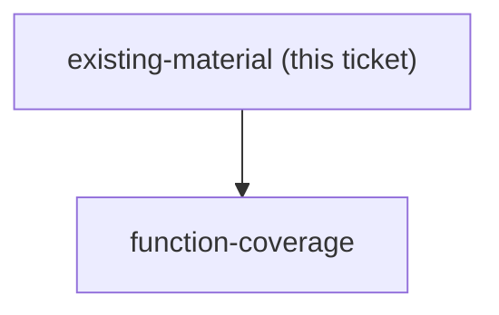

## Question

What official Anthropic learning material already exists - documentation, courses, cookbook, skill-authoring guides - that this workshop should reuse or point at rather than rewrite, and where are the gaps a factory-consulting audience still needs filled?

<!-- decision-map:graph:start -->

<!-- decision-map:graph:end -->
