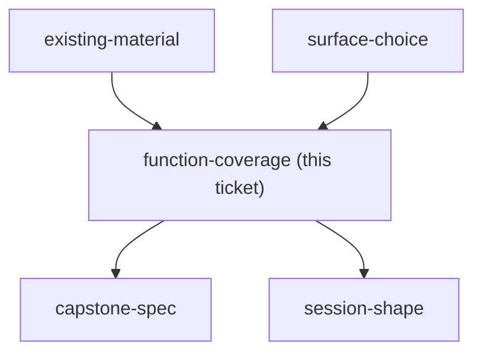

## Question

Which Claude functions are taught hands-on with a lab, which are demonstrated as reference only, and which are left out of the course entirely - across skills, subagents, MCP, hooks, plan mode, memory, artifacts, Claude Design, and Projects?

<!-- decision-map:graph:start -->

<!-- decision-map:graph:end -->
