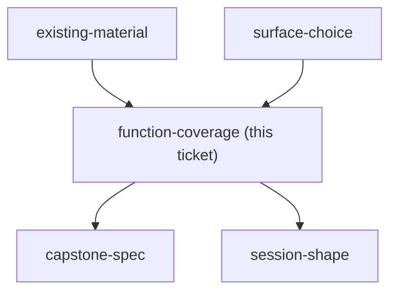
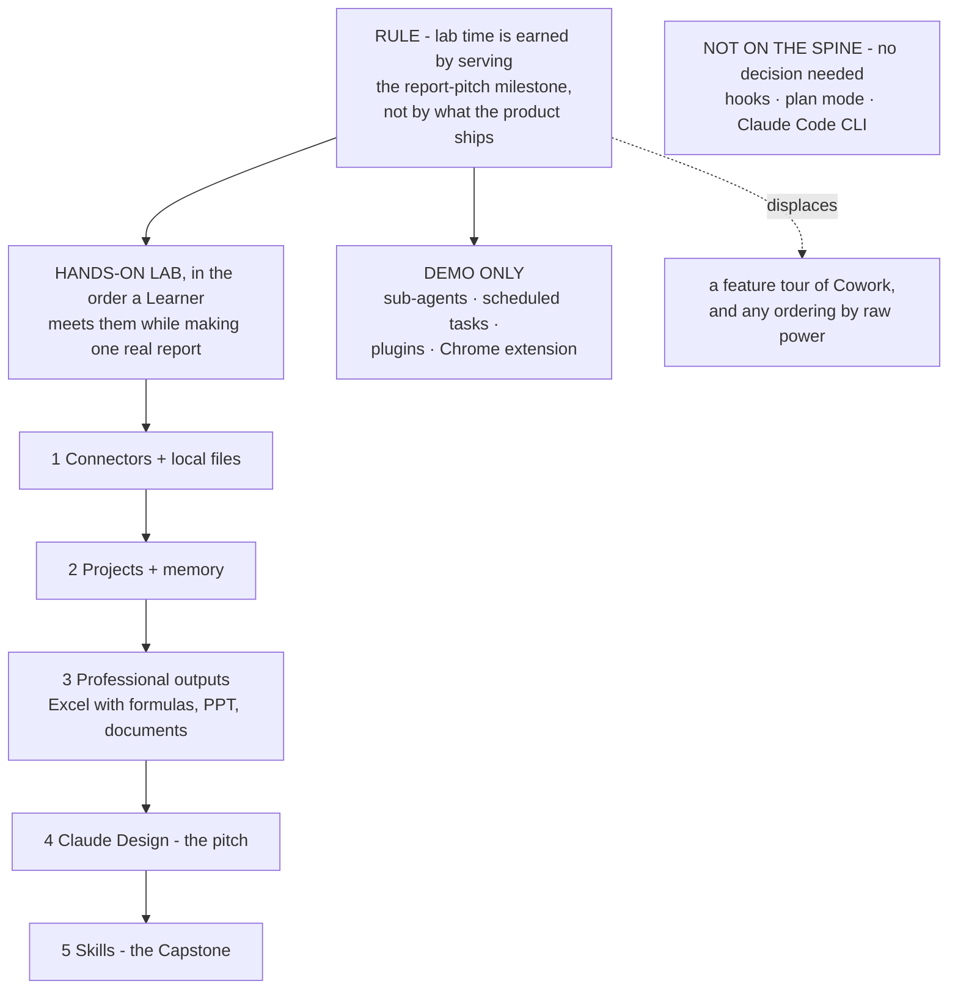

## Question

Which Claude functions are taught hands-on with a lab, which are demonstrated as reference only, and which are left out of the course entirely - across skills, subagents, MCP, hooks, plan mode, memory, artifacts, Claude Design, and Projects?

<!-- decision-map:graph:start -->

<!-- decision-map:graph:end -->

<!-- decision-map:resolution:start -->
## Resolution

Lab time is earned by serving the report-pitch milestone: connectors, Projects, outputs, Design, then Skills. Sub-agents, scheduled tasks and plugins are demo-only.

Detail: docs/adr/claude-course-0002-coverage-ordered-by-first-milestone.md

## The re-scope this ticket needed

The Question as charted asked which functions are taught "across skills,
subagents, MCP, hooks, plan mode, memory, artifacts, Claude Design, and
Projects". That list was written while a Claude Code Spine was still assumed. Two
of its entries - **hooks** and **plan mode** - are Claude Code concepts that do
not appear anywhere in Cowork's documented capabilities, so they are not choices;
and the list **omitted scheduled tasks entirely**, which is plausibly the
single highest-value function in the product for a consultant who files recurring
reports. The list was rebuilt against Cowork's own documentation before anything
was tiered.

## The deciding move

The owner named the first milestone during this session: **a client-facing report
and pitch, for consulting, management and business-analysis work.** That converted
coverage from an open ranking problem into an ordering one - a function earns a
Lab if a Learner needs it to carry one real report end to end, and waits
otherwise. It also settled the one question this session could not answer on its
own: scheduled tasks is demo-only, because it automates a workflow that must
already be stable, and nothing is stable during the course that creates it.

## Skills lands last, deliberately

The Capstone records a repeatable job. A Learner has no repeatable job in Claude
on day one - they have one only after steps 1 to 4 have carried a real report to
a client. Teaching Skills earlier would have them record a workflow they have not
yet performed.

## Confirming exchange

Presented with the tiering and asked whether scheduled tasks should earn a full
Lab or close the course as a demo, and whether anything in the grouping should
move, the owner answered by naming the first milestone instead: **"miletone แรก
จาก user คือ ทำ report pitch ลูกค้า Consult, บริหาร วิเคราะห์ ธุรกิจ"**. Shown
the coverage re-ordered against that milestone, together with the proposed
milestone membership, the owner answered **"ok"**.

## What this hands to other tickets

- `session-shape` - the Lab list is now ordered and countable, which is the input
  a session count was waiting on.
- `capstone-spec` - Skills is taught last, on a workflow the Learner has just
  performed. The fallback path also gained a step: Cowork does not read the
  Claude Code CLI's `~/.claude` directory, so a `SKILL.md` written there must be
  added in **Customize** before it is usable.
- `chrome-extension-usecases` - the Chrome extension pairs with Cowork by design
  rather than competing with it, which softens the overlap flagged in
  `claude-course-0001`.
- `design-deliverable` - Claude Design's Lab is step 4, and its deliverable is the
  pitch the client sees.

<!-- decision-map:resolution:end -->
