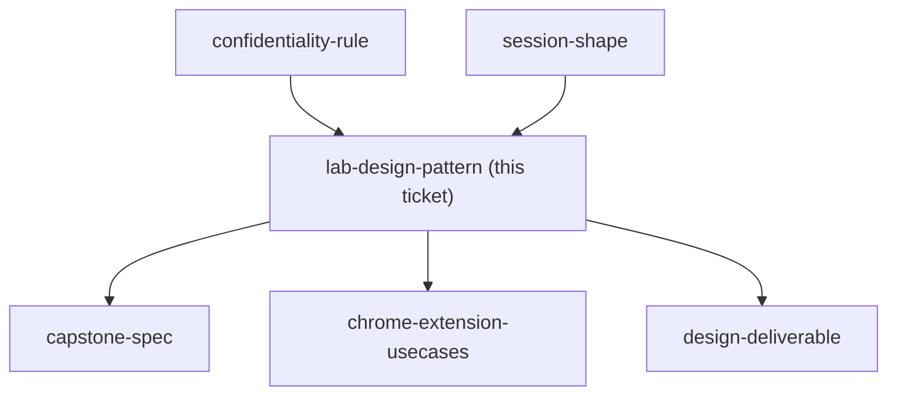

## Question

How is a lab written so it stays repeatable and checkable when every learner supplies different input - what is fixed (the steps, the checks, the definition of done) and what varies (their own document or data)?

<!-- decision-map:graph:start -->

<!-- decision-map:graph:end -->
