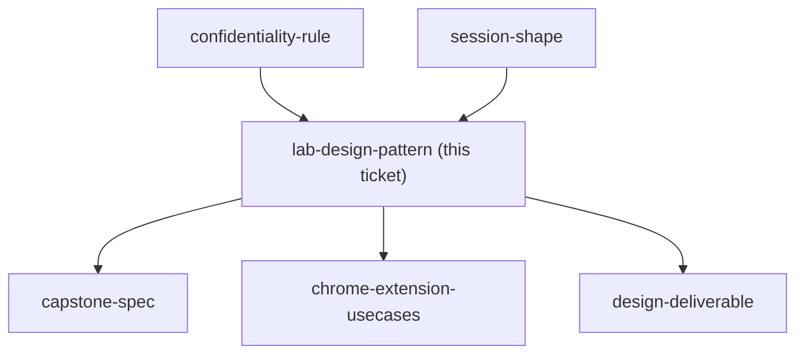
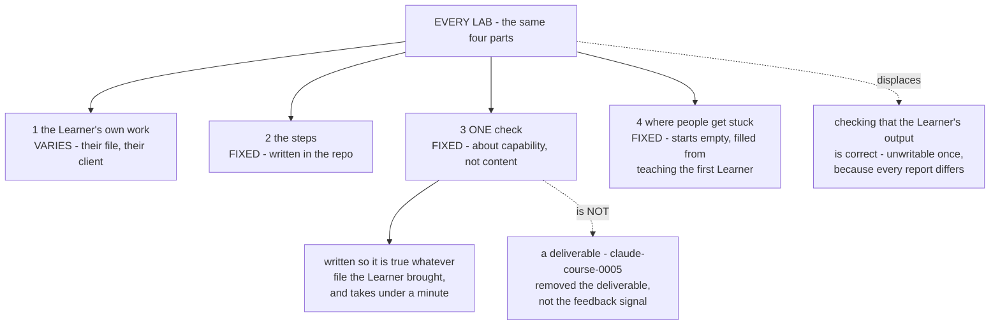

## Question

How is a lab written so it stays repeatable and checkable when every learner supplies different input - what is fixed (the steps, the checks, the definition of done) and what varies (their own document or data)?

<!-- decision-map:graph:start -->

<!-- decision-map:graph:end -->

<!-- decision-map:resolution:start -->
## Resolution

Every Lab has four parts: their own work varies; the steps, one check and the stuck-list are fixed. The check tests capability, not content, so it is writable once.

Detail: docs/adr/claude-course-0006-lab-pattern-capability-checks.md

## The re-scope this ticket needed

The charted Question asked how a Lab stays repeatable "when every learner supplies
different input". That premise assumed a cohort. `claude-course-0004` settled on
**one** Learner taught live by the author, so the ten-Learners-ten-files problem
does not exist and did not need solving.

The other half of the Question survived intact and got **sharper**, because
`claude-course-0005` had just removed the per-session deliverable. That turned the
open question into a single hard one: *if nothing has to be finished, what tells
anyone the Lab worked?*

## Two things that are easy to conflate

- A **deliverable** is something the Learner takes away and uses. Removed by
  `claude-course-0005`.
- A **check** is the thirty seconds that say "it works". Kept here.

Removing the deliverable does not remove the need for a feedback signal. Without a
check, neither the author nor the Learner knows whether to move on, and a Lab that
silently failed surfaces several sessions later, on top of work built over it.

## The rule that makes a check writable once

A check about **content** cannot be written once - every Learner's report is
different, so "the report is correct" has no fixed form. A check about **capability**
can. It holds whatever file was brought, and it runs in under a minute.

| Lab | The check |
|---|---|
| 1 Connectors and local files | Ask Claude a question whose answer is only in your own file. It answers correctly. |
| 2 Projects and memory | Close the Project and reopen it. Ask what you did last time. It answers. |
| 3 Professional outputs | Open the Excel file. Change one number. The formulas recalculate. |
| 4 Claude Design | Open the result on a phone. It is still readable. |
| 5 The Capstone Skill | Ask for the job in ordinary words, without naming the Skill. It runs. |

The Lab 5 check is the one that decides whether the Capstone passed. A `SKILL.md`
that exists but never triggers is not a working Skill, and nothing else in the
course would catch that.

## Part four starts empty, on purpose

"Where people get stuck" cannot be written before anyone has been taught. It is a
fixed part of the pattern with no content yet, filled in from what actually breaks
while teaching the first Learner. This is also the cheapest form of the instructor
material that `claude-course-0004` deferred - it is captured as a by-product of
teaching rather than written up front.

## Confirming exchange

Shown the four-part pattern, the capability-versus-content rule, the five checks,
and the explicit alternative of dropping checks entirely and teaching with no
measuring point at all, the owner answered **"โอเค"**.

## What this hands to other tickets

- `capstone-spec` - released. The Lab 5 check is already the pass condition: the
  Skill runs when asked in ordinary words, without being named.
- `design-deliverable` - released. Its Lab is number four and its check is the
  phone-readability test; what remains there is which real deliverable it builds.
- `chrome-extension-usecases` - released. Each use case it names now needs the same
  shape: a fixed step, and a capability check that holds whatever page is open.

<!-- decision-map:resolution:end -->
