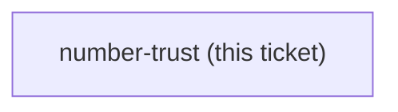

## Question

What does the course teach a Learner to do before they act on, or send to a client, a number that Claude produced - and which of the five Labs carries it? The stake is concrete: a consulting engineer who quotes a wrong figure in a BOQ or an energy-saving estimate damages a client relationship, and it is the kind of error a polished document hides rather than reveals. Note the gap this closes: the Lab 3 check from claude-course-0006 proves the spreadsheet recalculates, not that the number in it is right, so nothing in the course currently tests correctness of a figure.

<!-- decision-map:graph:start -->

<!-- decision-map:graph:end -->
