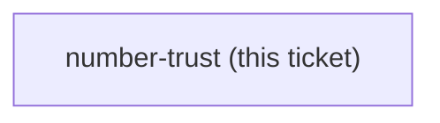
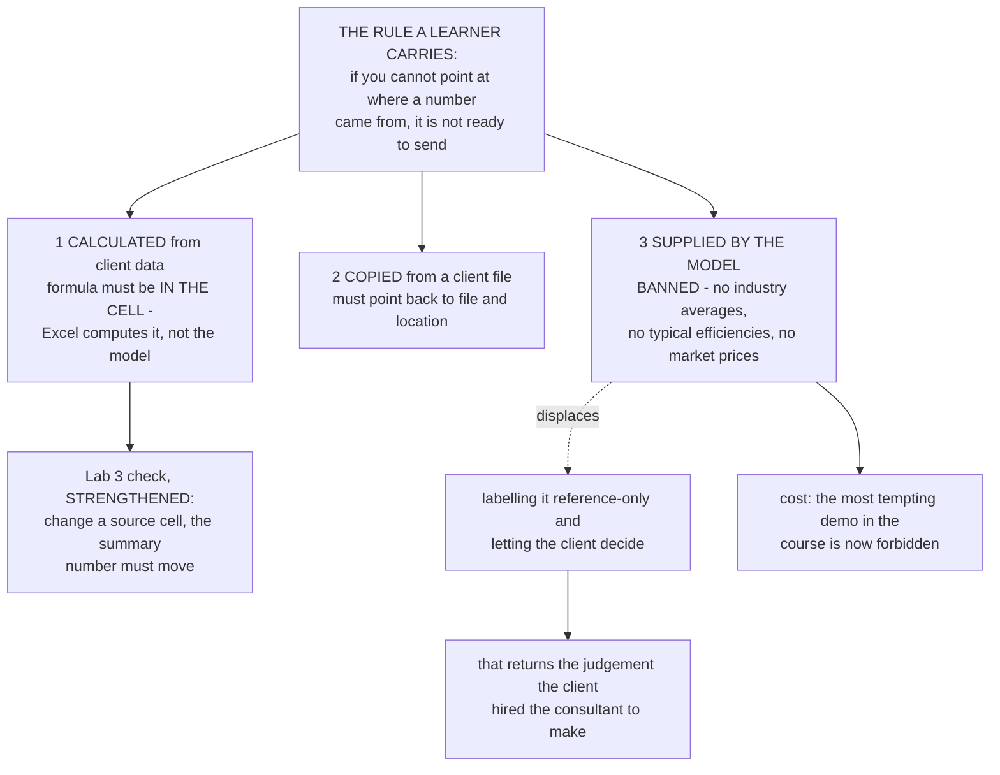

## Question

What does the course teach a Learner to do before they act on, or send to a client, a number that Claude produced - and which of the five Labs carries it? The stake is concrete: a consulting engineer who quotes a wrong figure in a BOQ or an energy-saving estimate damages a client relationship, and it is the kind of error a polished document hides rather than reveals. Note the gap this closes: the Lab 3 check from claude-course-0006 proves the spreadsheet recalculates, not that the number in it is right, so nothing in the course currently tests correctness of a figure.

<!-- decision-map:graph:start -->

<!-- decision-map:graph:end -->

<!-- decision-map:resolution:start -->
## Resolution

A number must point to a source: calculated ones carry their formula in the cell, copied ones name file and location, and model-supplied figures are banned outright.

Detail: docs/adr/claude-course-0007-numbers-must-point-to-a-source.md

## Why the question split three ways

Treating every number the same would have produced either a rule nobody follows
(check everything by hand) or no rule at all. Splitting by **where the number came
from** gives three different risks and three different, cheap treatments.

The decisive observation is about kind one. Cowork produces Excel with working
formulas (`claude-course-0002`), so the arithmetic does not have to happen in the
model at all. If the formula is in the cell, Excel computes the figure and the
Learner verifies one formula instead of auditing a column of numbers. That turns
the largest category of numbers from a per-figure problem into a per-formula one.

Kind three is the dangerous one, and it is dangerous for an unusual reason: it is
the **most convincing** of the three. A typical boiler efficiency or an industry
average arrives with no formula and no source, in fluent prose, and a polished
report hides it rather than revealing it.

## The ban, and the option it displaced

The owner was offered two positions on model-supplied figures: ban them, or allow
them with a label saying they are reference figures rather than client data. The
owner chose **"ห้ามเด็ดขาด"** - banned outright.

The chosen option is the stronger one. Labelling a figure and letting the client
decide whether to trust it hands back exactly the judgement the client hired the
consultant to make. Where a benchmark is genuinely needed, the Learner finds a
source themselves, and it becomes a kind-two number with a location to point at.

**The ban has a real cost, recorded so nobody quietly reverses it:** asking Claude
for a typical industry figure makes a striking demonstration, and it is precisely
the habit this course must not build.

## What changed in an already-closed decision

The Lab 3 check in `claude-course-0006` was *"open the Excel file, change one
number, the formulas recalculate"*. It proves the spreadsheet works. It does not
prove the client-facing figure was computed rather than typed. It is
**strengthened, not withdrawn**:

> Change a source cell. The summary number that goes to the client must move.

One action, two properties. If the summary does not move, the model typed a
constant - the entire risk of this ticket, caught in one gesture. The change is
recorded in three places: a dated amendment on `claude-course-0006`, a comment on
the closed `lab-design-pattern` ticket, and here.

## Which Lab carries it

Lab 3, enforced by that Lab's check. Lab 1 already primes the habit: its check
asks a question whose answer exists **only** in the Learner's own file, which is
the same idea one step earlier.

## Confirming exchange

Shown the three kinds, the formula-in-the-cell discipline, the strengthened Lab 3
check, and the two positions available on model-supplied figures, the owner
answered **"ห้ามเด็ดขาด"**.

<!-- decision-map:resolution:end -->
