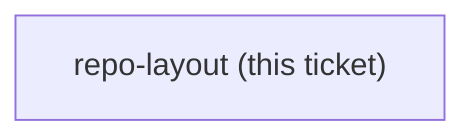

## Question

How is this repo laid out so that each session's instructor material, learner handout, lab and solution live together, and someone who clones it can teach or take the course without further assembly?

<!-- decision-map:graph:start -->

<!-- decision-map:graph:end -->
