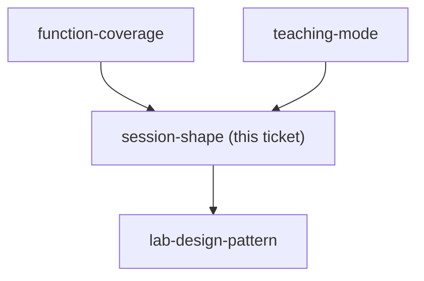
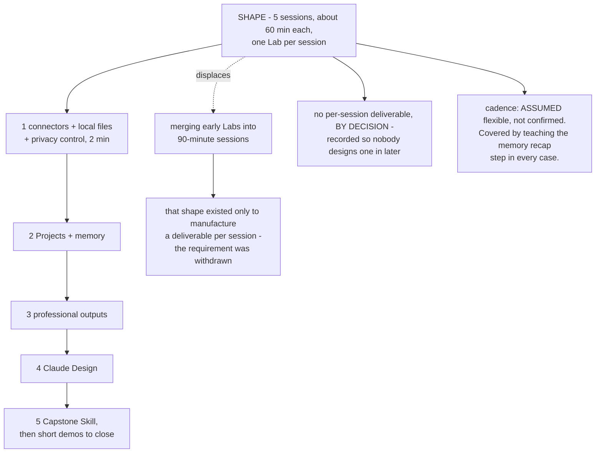

## Question

How many sessions does the course run to, how long is each, at what cadence, and what is the single deliverable a learner walks out of each session holding?

<!-- decision-map:graph:start -->

<!-- decision-map:graph:end -->

<!-- decision-map:resolution:start -->
## Resolution

Five sessions of about 60 minutes, one Lab each, no per-session deliverable by decision. Cadence is an assumption, made safe by teaching the memory recap step in every case.

Detail: docs/adr/claude-course-0005-five-short-sessions-one-lab-each.md

## What decided the session count

The charted Question asked for a deliverable per session. That requirement is what
made the count hard: the Lab order runs connectors, then Projects and memory, then
outputs, then Design, then the Capstone, and the first two produce nothing a
Learner would show anyone. Manufacturing a deliverable would have forced them to
merge into longer sessions.

The owner withdrew the requirement - *"ไม่จำเป็นต้องมีของกลับบ้านก็ได้ แค่สอน"* -
and the problem dissolved. One Lab per session is simpler, and it matches the
short-consecutive-sessions shape decided when the map was charted better than the
merged shape did.

**This is recorded as a decision, not an omission.** A later reader who finds no
per-session artifact must not treat it as a gap and design one in.

## What was deliberately NOT removed

"Just teach" removes the artifact from each session. It does not remove the goal.
The map's destination says a Learner can write their own working Skill, so the
Capstone stays in session five. This was stated to the owner rather than assumed:
removing the Capstone would be a change to the destination, not to this ticket,
and the owner did not ask for that.

## The one thing that is an assumption

The gap between sessions was asked three times and never answered - the owner
replied "ok" to the shape twice without choosing a cadence. Rather than ask a
fourth time or silently pick one, it is recorded as **flexible, fitted to the
Learner's job queue, and marked as an assumption**.

The assumption is made safe by design rather than by confidence. The course
**teaches the memory recap step in every case**: a Learner opens each session by
asking Claude to summarise the previous session from the Project memory. It costs
about two minutes, it is useful even on consecutive days, and it removes the only
way a wrong cadence guess could hurt the course. If the real cadence is
consecutive days, one line of `claude-course-0005` changes and nothing else.

## Confirming exchange

Presented with two shapes - six short sessions with weak early sessions, or four
merged 90-minute sessions - the owner rejected the premise instead: *"ไม่จำเป็น
ต้องมีของกลับบ้านก็ได้ แค่สอน"*. The five-session shape was then re-pitched in
Simplified Technical English after the owner invoked `/wait-what`, and answered
**"ok"**. A follow-up asking only for the cadence was answered **"ok"** again,
which is why cadence is recorded as an assumption above.

## What this hands to other tickets

- `lab-design-pattern` - released. Each Lab now has a known budget: about 60
  minutes, one Lab, one Learner, no artifact required at the end.
- `env-setup-lab` - session 1 holds connectors, local files and the two-minute
  privacy control from `claude-course-0003`. The repo is already on the machine
  before session 1 starts (`claude-course-0004`).
- `capstone-spec` - the Capstone has session five, after the Learner has carried
  one real report through sessions 1 to 4. It is the only required artifact in the
  course.

<!-- decision-map:resolution:end -->
