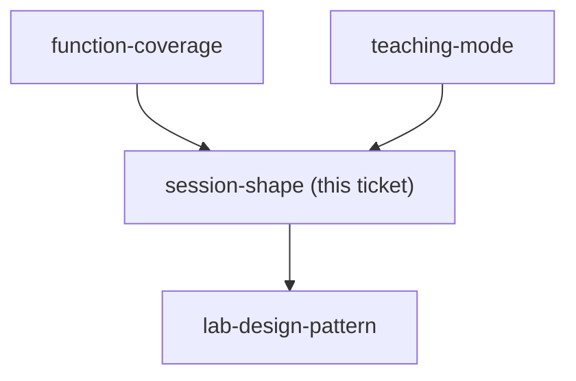

## Question

How many sessions does the course run to, how long is each, at what cadence, and what is the single deliverable a learner walks out of each session holding?

<!-- decision-map:graph:start -->

<!-- decision-map:graph:end -->
