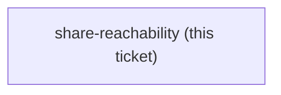

## Question

Does Cowork's isolated VM read a mounted SMB or network share as a Working folder on a Mac? claude-course-0008 makes a folder on local disk the required baseline and the share a try-first step; claude-course-0009 puts that attempt at step 7 of the Setup. So the course is correct either way - but no test has ever been run, and both cowork-connectors and env-setup-lab closed by pointing at the other. The answer decides whether the Learner works from live project files or from a copy that goes stale between sessions. Needs a real Mac in front of a real project share; record what was tried, what the share type was, and what Cowork did.

<!-- decision-map:graph:start -->

<!-- decision-map:graph:end -->
