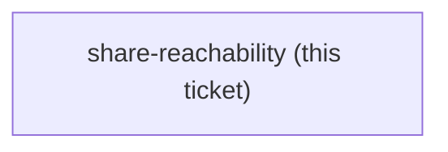
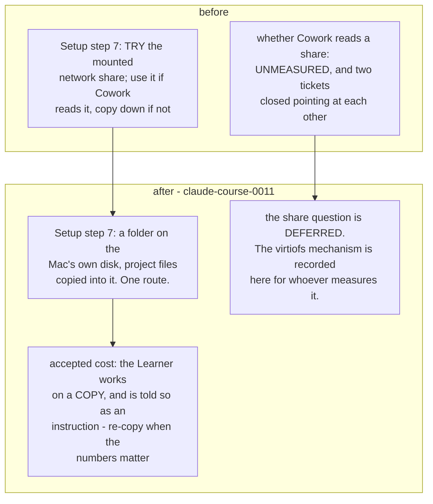

## Question

Does Cowork's isolated VM read a mounted SMB or network share as a Working folder on a Mac? claude-course-0008 makes a folder on local disk the required baseline and the share a try-first step; claude-course-0009 puts that attempt at step 7 of the Setup. So the course is correct either way - but no test has ever been run, and both cowork-connectors and env-setup-lab closed by pointing at the other. The answer decides whether the Learner works from live project files or from a copy that goes stale between sessions. Needs a real Mac in front of a real project share; record what was tried, what the share type was, and what Cowork did.

<!-- decision-map:graph:start -->

<!-- decision-map:graph:end -->

<!-- decision-map:resolution:start -->
## Resolution

Deferred, not measured: the Working folder is local disk only through report-pitch, Setup step 7 drops the share attempt, and the virtiofs mechanism is recorded for whoever measures it later.

Detail: docs/adr/claude-course-0011-local-folder-only-for-the-first-milestone.md

Resolved by removing the dependency rather than by measuring. No network share was
available to test against, and the course does not need the answer inside
`report-pitch`.

## What was measured

Not the share - there was none to mount. What was established is the **mechanism**
a later measurement would be testing, from the author's own Mac (macOS 26.5.2,
Claude 1.37937.3, logs under `~/Library/Logs/Claude/`, one account):

- Cowork is a full Linux VM under Apple's Virtualization framework: `coworkd.log`
  is a kernel boot log, `vzgvisor.log` shows its virtual network.
- Host folders reach the VM over **virtiofs**, appearing in the guest at
  `/mnt/.virtiofs-root/shared/<the host's absolute path>`, then bind-mounted per
  session onto `/sessions/<name>/mnt/work` (`mode=rw`, `ro` or `rwd`).
- Every share observed sat under `shared/Users/<user>/…` - the host path
  reproduced verbatim, which reads as a share rooted at `/` rather than at the
  home folder.
- No `/Volumes/` path appears in any of the 5 Cowork logs. **This is not evidence
  either way**: no network share has ever been mounted on that machine, and
  `mount` showed zero smbfs/afpfs/nfs at the time of writing.

The question left for whoever needs it: does virtiofs traverse into a *different*
filesystem mounted at `/Volumes`, and does Cowork's folder picker offer one at
all. It needs a Mac with a real share mounted.

## The confirming exchange

Asked whether a project share was available to test against: *"no"*.

Then, unprompted: *"we will not use sharedrive for first milestone"*.

Offered the choice between cutting the try-step from the Setup entirely (A) and
keeping it as an optional 30-second attempt (B). Answer: *"a"*.

<!-- decision-map:resolution:end -->
