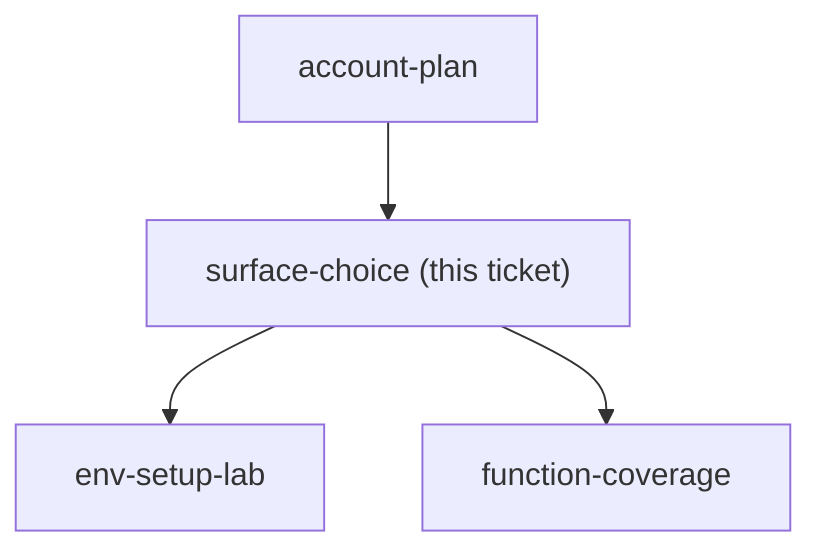

## Question

Which surface does the course teach on as its spine - Claude Code in the terminal or VSCode, claude.ai with Projects, or the Desktop app - and which others are shown only for contrast? Note two constraints already fixed: Claude Design and learner-authored skills both live in Claude Code, so a course that must deliver both cannot use a web-only spine; and the Claude Chrome extension is a fourth surface the course must teach alongside whichever spine is chosen.

<!-- decision-map:graph:start -->

<!-- decision-map:graph:end -->
