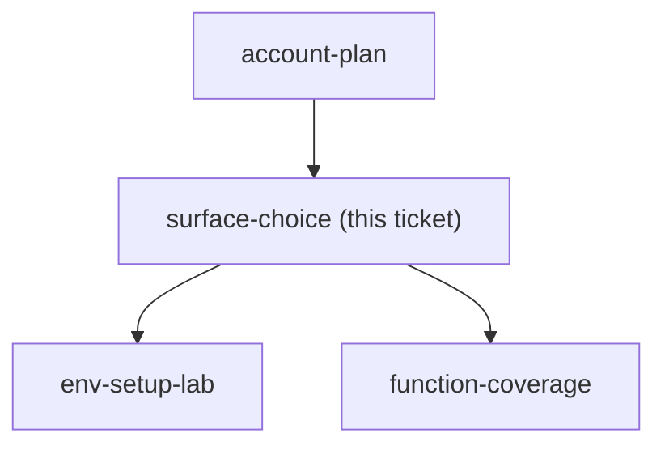
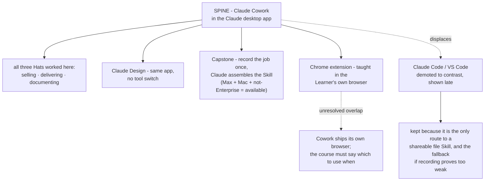

## Question

Which surface does the course teach on as its spine - Claude Code in the terminal or VSCode, claude.ai with Projects, or the Desktop app - and which others are shown only for contrast? Note two constraints already fixed: Claude Design and learner-authored skills both live in Claude Code, so a course that must deliver both cannot use a web-only spine; and the Claude Chrome extension is a fourth surface the course must teach alongside whichever spine is chosen.

<!-- decision-map:graph:start -->

<!-- decision-map:graph:end -->

<!-- decision-map:resolution:start -->
## Resolution

Claude Cowork in the desktop app is the Spine; Claude Code is shown late as contrast and as the fallback if record-a-skill proves too weak.

Detail: docs/adr/claude-course-0001-cowork-as-the-spine.md

## The re-scope this ticket needed

The Question as charted carried a constraint that was **false**: *"Claude Design
and learner-authored skills both live in Claude Code, so a course that must
deliver both cannot use a web-only spine."* Both halves are wrong. Claude Design
has its own claude.ai help page and a Team/Enterprise admin guide, and Skills
have an official no-code authoring route. The constraint was written at chart
time from an assumption, and it would have forced Claude Code as the answer by
definition rather than by argument. The ticket was resolved against the corrected
facts.

The cohort also changed mid-session. The map assumed Windows machines and,
following `account-plan`, a Team or Enterprise account. The owner corrected both:
**individual Max plans, Mac machines, Chrome.** That correction is recorded as a
comment on `account-plan`, whose gist still reads "Team or existing Enterprise" -
correct as a recommendation, wrong as a description of this cohort.

## Why Cowork won

- Anthropic pitches Cowork at reports, spreadsheets, bulk review, contract review
  and synthesis. That list is the Learner's job. The VS Code extension is built
  around repositories, inline diffs and pull requests, which the Learner does not
  have and would stare at for the whole course.
- The Capstone route works for exactly this cohort: *"Recording a skill is
  available on Pro, Max, and Team plans, in Cowork in Claude for Mac. It isn't
  available in chat, on Windows, or on Free and Enterprise plans."*
- Sharing a finished Skill was declared optional, which removes the one
  requirement that would have forced a file-based Skill and therefore Claude Code.

**An argument that did NOT decide it:** "the terminal is too hard". The VS Code
extension bundles its own CLI for the chat panel, so Claude Code there is a
graphical panel, not a terminal. Claude Code lost on what its interface is
*about*, not on difficulty. Recording this because it is the argument most likely
to be re-proposed later in a weaker form.

## Confirming exchange

Asked which the Learner opens on the Monday after the course, the owner answered
**"เอา claude cowork เป็นหลัก"**. Shown the full shape that follows from it -
Cowork as Spine, Design on the same app, Chrome extension in their own browser
with the built-in-browser overlap flagged, record-a-skill as the Capstone, Claude
Code late as contrast and fallback, and both unproven risks carried forward - the
owner answered **"ok"**.

Earlier in the same session, asked whether a finished Skill must be shareable
with teammates, the owner answered **"ให้ก็ได้ ไม่ให้ก็ได้"**, which is what made
the file-based route optional rather than required.

## What this hands to other tickets

- `chrome-extension-usecases` - Cowork's built-in browser overlaps the Chrome
  extension; the course must draw the line.
- `capstone-spec` - the quality of a recorded Skill is unproven and must be tried
  by hand; if it is too weak, the Capstone falls back to writing `SKILL.md` in
  Claude Code.
- `lab-design-pattern` - how well Cowork grips a Learner's local work folder was
  not settled from published pages (Anthropic's own copy says local files in an
  isolated VM; the product page leads with Microsoft 365 and Google Drive
  connectors). Measure it before designing Labs around it.
- `confidentiality-rule` - individual Max means consumer terms and no admin
  lever, so each Learner sets their own training toggle before the first Lab that
  carries real client work.

<!-- decision-map:resolution:end -->
