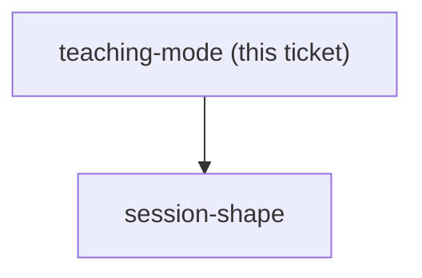
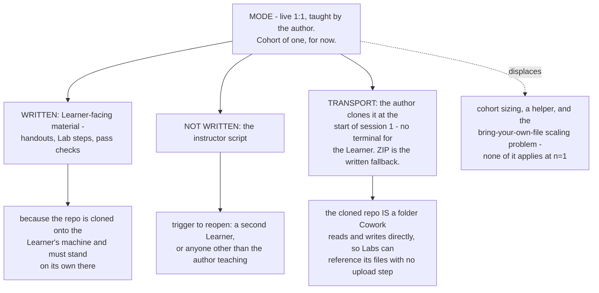

## Question

Is this always taught live by the author, to a cohort of what size, and must the material still work when a different instructor runs it - which decides how much instructor script is written versus left to the room?

<!-- decision-map:graph:start -->

<!-- decision-map:graph:end -->

<!-- decision-map:resolution:start -->
## Resolution

Live 1:1 by the author. Learner-facing material is written because the repo is cloned to their machine; the instructor script is deferred until a second Learner or a second instructor.

Detail: docs/adr/claude-course-0004-taught-one-to-one-learner-material-written.md

## The constraint that turned out not to bind

Every Lab runs on the Learner's own files, so instructor attention does not scale
the way a lecture does: briefing ten people and briefing thirty costs the same,
but helping ten people fix their own spreadsheets and helping thirty does not.
That would have forced either a helper or a change in Lab format at any real
cohort size. At **one Learner** it does not bind at all, which is why no cohort
size, no helper and no room logistics are recorded here. If a cohort ever
appears, this is the constraint that returns first.

## What is settled, and what is deliberately not

**Settled - Learner-facing material is written.** The repo is cloned onto the
Learner's machine, and a cloned repo with nothing in it is useless. Handouts, Lab
steps and pass checks must stand on their own there; the author being in the room
does not excuse writing them.

**Deliberately deferred - the instructor script.** With one Learner and the author
teaching, it is written for a reader who does not exist. The owner was asked twice
whether a second Learner is likely and answered other things both times, so it is
recorded as deferred with a **named trigger** rather than guessed at: a second
Learner, or anyone other than the author teaching. A deferral without a trigger is
just an omission nobody notices until it hurts.

## Transport

Four routes were on the table: the Learner runs `git clone`, the Learner downloads
a ZIP, the author clones it for them, or the material lives somewhere other than a
repo. The author clones it, at the start of session 1.

The reason is not convenience. `claude-course-0001` chose a Spine with no
terminal; having the Learner run `git clone` would put a terminal in the **first
minute** of the course, contradicting the reason that Spine was chosen at all. A
ZIP download is documented in the material as the fallback for setup without the
author present. Both are scoped to one Learner, and the trigger above reopens them.

## Confirming exchange

Asked how many Learners per cohort and whether a helper would be present, the
owner answered **"สอนแค่คนเดียวตอนนี้"**. Asked to choose a transport once the
terminal contradiction was pointed out, the owner chose **"c"** - the author
clones it. Shown the full shape, including the deferred instructor script with its
trigger and the proposal to move this ticket into the `report-pitch` milestone,
the owner answered **"โอเค"**.

## What this hands to other tickets

- `session-shape` - released. At n=1 the session count and length are free of
  cohort logistics and answer only to the Lab ordering in `claude-course-0002`.
- `repo-layout` - the cloned repo is simultaneously the course material and the
  Learner's Cowork working folder. Design for that: Labs can reference repo files
  by path with no upload step.
- `env-setup-lab` - the Learner's day zero starts with the repo already on their
  machine, so setup begins at connectors and the privacy-control segment from
  `claude-course-0003`, not at a download.

<!-- decision-map:resolution:end -->
