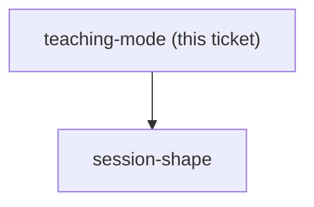

## Question

Is this always taught live by the author, to a cohort of what size, and must the material still work when a different instructor runs it - which decides how much instructor script is written versus left to the room?

<!-- decision-map:graph:start -->

<!-- decision-map:graph:end -->
